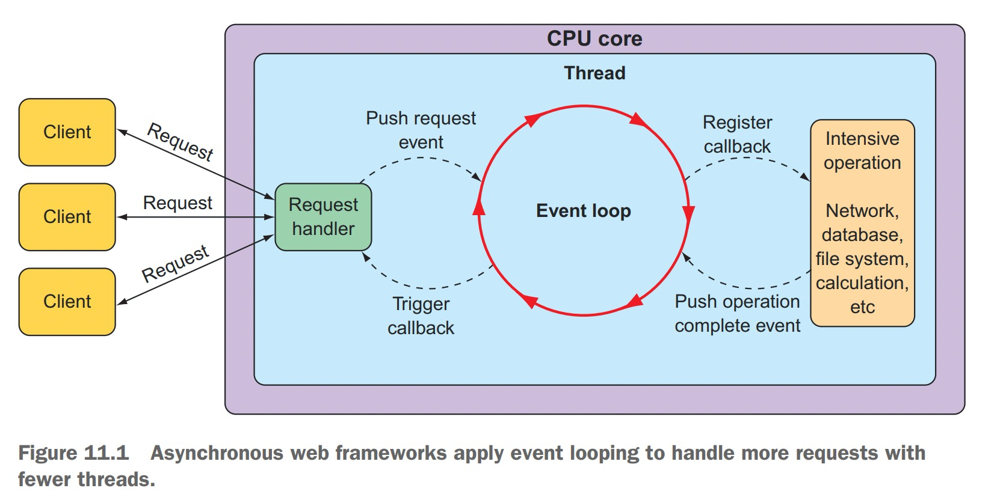
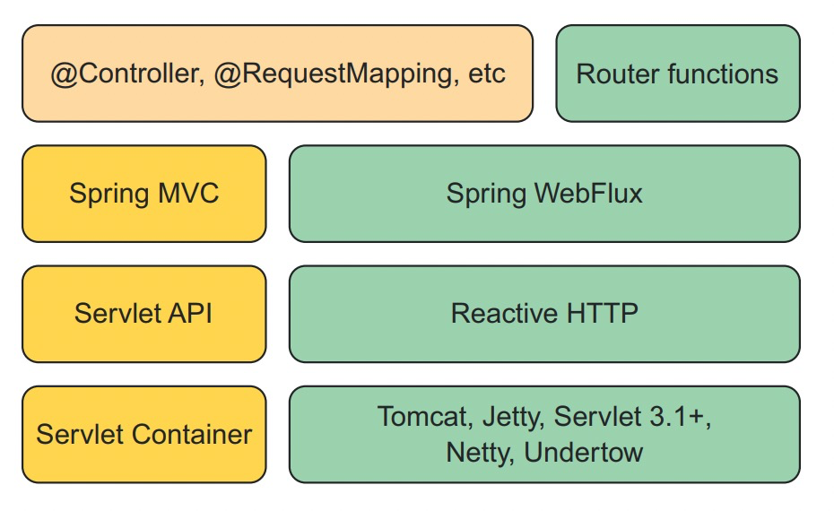

# Imperative Programming vs Reactive Programming
Imperative programming is simple: you write code as a list of instructions to be followed, one at a time, in the order that they're encountered. A task is performed and the program waits for it to complete before moving to the next task. At each step along the way, the data that's to be processed must be fully available so that it can be processed as a whole. While a task is being performed, and especially if it's an I/O task such as writing data to a database or fetching data from a remote server, the thread that invoked that task is blocked, unable to do anything else until the task completes. Many programming languages, including Java, support concurrent programming. But managing concurrency in multiple threads is challenging. More threads mean more complexity.

Rather than describe a set of steps that are to be performed sequentially, reactive programming involves describing a pipeline or stream through which data flows. Rather than requiring the data be available to be processed as a whole, a reactive stream processes data as it becomes available.

# Reactive Streams
Reactive Streams aims to provide a standard for asynchronous stream processing with non-blocking backpressure. 

Backpressure is a means by which consumers of data can avoid being overwhelmed by an overly fast data source, by establishing limits on how much they're willing to handle.

The Reactive Streams specification can be summed up by four interface definitions: **Publisher**, **Subscriber**, **Subscription**, and **Processor**. 

A **Publisher** produces data that it sends to a **Subscriber** per a **Subscription**. 
```java
public interface Publisher<T> {
		void subscribe(Subscriber<? super T> subscriber);
}
```

Once a **Subscriber** has subscribed, it can receive events from the **Publisher**. Those events are sent via methods on the **Subscriber** interface.
```java
public interface Subscriber<T> {
		void onSubscribe(Subscription sub);
		void onNext(T item);
		void onError(Throwable ex);
		void onComplete();
}
```

When the **Publisher** calls **onSubscribe()**, it passes a **Subscription** object to the **Subscriber**. It is through the **Subscription** that the **Subscriber** can manage its subscription.
```java
public interface Subscription {
		void request(long n);
		void cancel();
}
```

As for the **Processor** interface, it's a combination of **Subscriber** and **Publisher**. As a **Subscriber**, a **Processor** will receive data and process it in some way. Then it will switch hats and act as a **Publisher** to publish the results to its **Subscriber**s.

# Project Reactor
Project Reactor is an implementation of the Reactive Streams specification that provides a functional API for composing Reactive Streams. Also, Reactor is the foundation for Spring 5's reactive programming model.

```java
Mono.just("Craig")
		.map(n -> n.toUpperCase())
		.map(cn -> "Hello, " + cn + "!")
		.subscribe(System.out::println);
```

**Flux** and **Mono** are the most essential building blocks provided by Reactor.

Reactor provides several operations for creating **Flux**es and **Mono**s.
```java
// from objects
Flux<String> fruitFlux = Flux.just("Apple", "Orange", "Grape", "Banana", "Strawberry");

// from array
String[] fruits = new String[] {"Apple", "Orange", "Grape", "Banana", "Strawberry"};
Flux<String> fruitFlux = Flux.fromArray(fruits);

// from iterable
List<String> fruitList = new ArrayList<>();
fruitList.add("Apple");
fruitList.add("Orange");
fruitList.add("Grape");
fruitList.add("Banana");
fruitList.add("Strawberry");
Flux<String> fruitFlux = Flux.fromIterable(fruitList);

// from stream
Stream<String> fruitStream = Stream.of("Apple", "Orange", "Grape", "Banana", "Strawberry");
Flux<String> fruitFlux = Flux.fromStream(fruitStream);

// from range
Flux<Integer> intervalFlux = Flux.range(1, 5);

// from interval
Flux<Long> intervalFlux = Flux.interval(Duration.ofSeconds(1)).take(5);
```

**mergeWith** example:
```java
Flux<String> characterFlux = Flux.just("Garfield", "Kojak", "Barbossa")
		.delayElements(Duration.ofMillis(500));
Flux<String> foodFlux = Flux.just("Lasagna", "Lollipops", "Apples")
		.delaySubscription(Duration.ofMillis(250))
		.delayElements(Duration.ofMillis(500));
		
Flux<String> mergedFlux = characterFlux.mergeWith(foodFlux);
```

**zip** example:
```java
Flux<String> characterFlux = Flux.just("Garfield", "Kojak", "Barbossa");
Flux<String> foodFlux = Flux.just("Lasagna", "Lollipops", "Apples");

Flux<Tuple2<String, String>> zippedFlux = Flux.zip(characterFlux, foodFlux);

Flux<String> zippedFlux = Flux.zip(characterFlux, foodFlux, (c, f) -> c + " eats " + f);
```

**skip** example:
```java
Flux<String> skipFlux = Flux.just("one", "two", "skip a few", "ninety nine", "one hundred")
		.skip(3);
		
Flux<String> skipFlux = Flux.just("one", "two", "skip a few", "ninety nine", "one hundred")
		.delayElements(Duration.ofSeconds(1))
		.skip(Duration.ofSeconds(4));
```

**take** example:
```java
Flux<String> nationalParkFlux = Flux.just("Yellowstone", "Yosemite", "Grand Canyon", "Zion", "Grand Teton")
		.take(3);

Flux<String> nationalParkFlux = Flux.just("Yellowstone", "Yosemite", "Grand Canyon", "Zion", "Grand Teton")
		.delayElements(Duration.ofSeconds(1))
		.take(Duration.ofMillis(3500));
```

**filter** example:
```java
Flux<String> nationalParkFlux = Flux.just("Yellowstone", "Yosemite", "Grand Canyon", "Zion", "Grand Teton")
		.filter(np -> !np.contains(" "));
```

**distinct** example:
```java
Flux<String> animalFlux = Flux.just("dog", "cat", "bird", "dog", "bird", "anteater")
		.distinct();
```

**map** example:
```java
Flux<Player> playerFlux = Flux.just("Michael Jordan", "Scottie Pippen", "Steve Kerr")
		.map(n -> {
				String[] split = n.split("\\s");
				return new Player(split[0], split[1]);
		});
```

**flatMap** example:
```java
Flux<Player> playerFlux = Flux.just("Michael Jordan", "Scottie Pippen", "Steve Kerr")
		.flatMap(n -> Mono.just(n)
				.map(p -> {
						String[] split = p.split("\\s");
						return new Player(split[0], split[1]);})
				.subscribeOn(Schedulers.parallel())
		);
```

**buffer** example:
```java
Flux<String> fruitFlux = Flux.just("apple", "orange", "banana", "kiwi", "strawberry");
Flux<List<String>> bufferedFlux = fruitFlux.buffer(3);

Flux.just("apple", "orange", "banana", "kiwi", "strawberry")
		.buffer(3)
		.flatMap(x -> Flux.fromIterable(x)
				.map(y -> y.toUpperCase())
				.subscribeOn(Schedulers.parallel())
				.log())
		.subscribe();
```

**collectList** example:
```java
Flux<String> fruitFlux = Flux.just("apple", "orange", "banana", "kiwi", "strawberry");
Mono<List<String>> fruitListMono = fruitFlux.collectList();
```

**collectMap** example:
```java
Flux<String> animalFlux = Flux.just("aardvark", "elephant", "koala", "eagle", "kangaroo");
Mono<Map<Character, String>> animalMapMono = animalFlux.collectMap(a -> a.charAt(0));
```

**all** and **any** example:

```java
Flux<String> animalFlux = Flux.just("aardvark", "elephant", "koala", "eagle", "kangaroo");
Mono<Boolean> allHasA = animalFlux.all(a -> a.contains("a"));
Mono<Boolean> anyHasT = animalFlux.any(a -> a.contains("t"));
```

# Spring WebFlux
Typical Servlet-based web framework, such as Spring MVC, are blocking and multithreaded in nature, using a single thread per connection. As requests are handled, a worker thread is pulled from a thread pool to process the request. Meanwhile, the request thread is blocked until it's notified by the worker thread that it's finished. Consequently, blocking web frameworks won't scale effectively under heavy request volume.

Asynchronous web frameworks, in contrast, achieve higher scalability with fewer threads, generally one per CPU core. By applying a technique known as *event looping*, these frameworks are able to handle many requests per thread, making the per-connection cost more economical.



In an event loop, everything is handled as an event, including requests and callbacks from intensive operations like database and network operations. When a costly operation is needed, the event loop registers a callback for that operation to be performed in parallel, while it moves on to handle other events. When the operation is complete, it is treated as an event by the event loop, the same as requests. As a result, asynchronous web frameworks are able to scale better under heavy request volume with fewer threads, resulting in reduced overhead for thread management.

Spring 5 has introduced Spring WebFlux, a non-blocking, asynchronous web framework based largely on Project Reactor.

## Spring MVC vs Spring WebFlux


Spring MVC sits atop the Java Servlet API, which requires a servlet container (such as Tomcat) to execute on.

By constrast, Spring WebFlux doesn't have ties to the Servlet API, so it builds on top of a Reactive HTTP API, which is a reactive approximation of the same functionality provided by the Servlet API. And because Spring WebFlux isn't coupled to the Servlet API, it doesn't require a servlet container to run on. Instead, it can run on any non-blocking web container including Netty, Undertow, Tomcat, Jetty, or any Servlet 3.1 or higher container.

Spring WebFlux is a fantasic alternative to Spring MVC, offering the option of writing reactive web applications using the same development model as Spring MVC.

## Spring WebFlux examples
```java
@RestController
@RequestMapping(path = "/taco", produces = "application/json")
public class TacoController {
	@Autowired
	private TacoRepository tacoRepository;

	@GetMapping("/recent")
	public Flux<Taco> recentTacos() {
		return tacoRepository.findAll().take(12);
	}

	@PostMapping(consumes = "application/json")
	@ResponseStatus(HttpStatus.CREATED)
	public Mono<Taco> postTaco(@RequestBody Mono<Taco> taco) {
		return tacoRepository.saveAll(taco).next();
	}
}
```

## Spring WebFlux functional programming model
As an alternative to WebFlux, Spring 5 has introduced a new functional programming model for defining reactive APIs.

Writing an API using Spring's functional programming model involves four primary type:
- **RequestPreficate**, declares the kind of requests that will be handled
- **RouterFunction**, declares how a matching request should be routed to handler code
- **ServerRequest**, represents an HTTP request, including access to header and body information
- **ServerResponse**, represents an HTTP response, including header and body information
