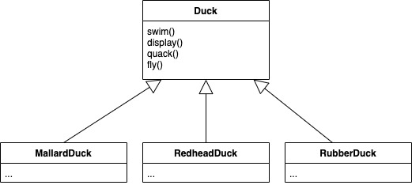
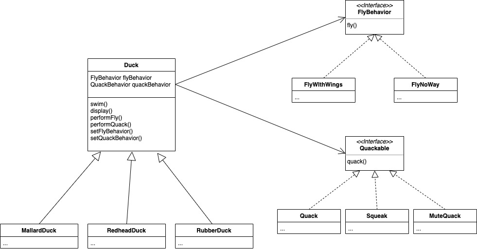

The strategy pattern defines a family of algorithms, encapsulate each one, and makes them interchangeable. The strategy pattern lets the algorithm vary independently from clients that use it.

一个有quack()、swim()、display()、fly()的父类duck，所有子类duck继承自它，并且依据各自的特性override这几个方法，有什么问题吗？The problem is that not all of the subclasses should have flying or quacking behavior, 你需要在所有不具有fly()能力的子类duck中重载这个方法，so inheritance isn't the right answer.

既然不是所有子类duck都具有fly或quack的能力，那就把它们从父类duck中拿出来，单独定义Flyable和Quackable的interface. Only the ducks that are supposed to fly will implement the Flyable interface and have a fly() method.

新的问题来了，if you thought having to override a few methods was bad, how are you gonna feel when you need to make a little change to the flying behavior in all of the flyable duck subclasses? 将fly()从父类duck中拿出来作为单独的interface，是避免无效的code reuse，但是同时，等于完全没有了code reuse.

如何解决上面的问题呢？fly()不管是放到父类duck里，还是定义Flyable接口而让子类duck去各自实现，结果都是fly这个能力和duck的强耦合。我们要把fly的能力与duck分离开，并且希望可以动态、灵活的赋予duck某一种fly能力。

我们定义FlyBehavior接口，不同的fly分别实现这个接口，it won't be the duck classes that implement the flying interface, instead, we will make a set of classes whose entire reason for living is to represent a behavior and it's the behavior class, rather than the duck class, that will implement the behavior interface. 

The duck subclasses will use a behavior represented by an interface, so that the actual implementation of the behavior won't be locked into the duck subclass. 也就是说，我们把fly抽离出来，单独定义接口和实现，duck以composition的形式使用fly这个能力。

