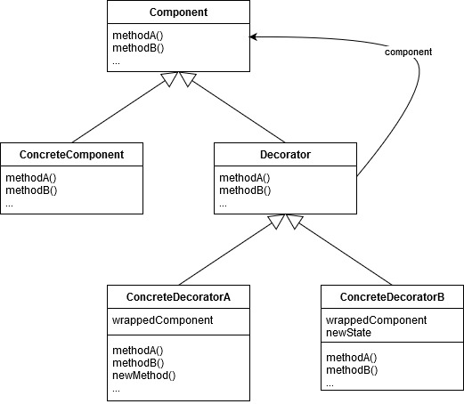
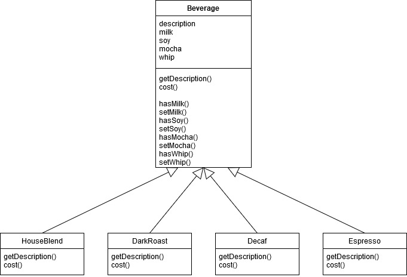
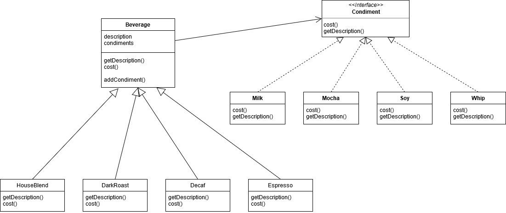
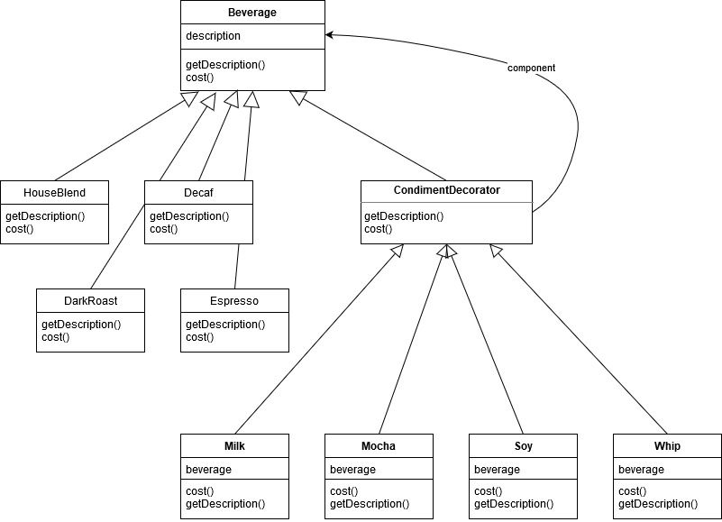

The decorator pattern attaches additional responsibilities to an object dynamically. Decorators provide a flexible alternative to subclassing for extending functionality.

Once you know the techniques of decorating, you'll be able to give your (or someone else's) objects new responsibilities without making any code changes to the underlying classes.

Decorator具备以下特性：
- decorators have the same supertype as the objects they decorate
- given that the decorator has the same supertype as the object it decorates, we can pass around a decorated object in place of the original (wrapped) object
- you can use one or more decorators to wrap an object
- the decorator adds its own behavior either before or after delegating to the object it decorates to do the rest of the job
- objects can be decorated at any time, so we can decorate objects dynamically at runtime with as many decorators as we like

应用实例：

