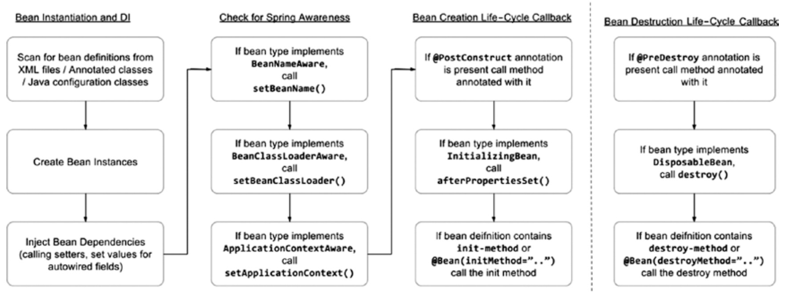

An important part of any IoC container, Spring included, is that beans can be constructed in such a way that they receive notifications at certain points in their lefe cycle. This enables your beans to perform relevant processing at certain points throughout their life. 

In general, two life-cycle events are particularly relevant to a bean: post-initialization and pre-destruction. In the context of Spring, the post-initialization event is raised as soon as Spring finishes setting all the property values on the bean and finishes any dependency checks that you configured it to perform. The pre-destruction event is fired just before Spring destroys the bean instance.

By being aware of when it is initialized, a bean can check whether all its required dependencies are satisfied. Using an initialization callback, your bean can check for the dependencies it requires, throwing an exception or providing a default as needed.

The destruction callback is often used in conjunction with the initialization callback. In many cases, you create and configure a resource in the initialization callback and then release the resource in the destruction callback.

The destruction callback is an ideal mechanism for ensuring that your applications shut down gracefully and do not leave resources open or in an inconsistent state.

# Bean Life-Cycle Management Mechanisms
Spring provides three mechanisms a bean can use to hook into each of these events and perform some additional processing: interface-based, method-based, and annotation-based mechanisms.

Overall, the choice of which mechanism you use for receiving life-cycle notifications depends on your application requirement. If you are concerned about portability or you are just defining one or two beans of a particular type that need the callbacks, use the method-based mechanism. If you use annotation-type configuration and are certain that you are using an IoC container that supports JSR-250, use the annotation mechanism. If you are not too concerned about portability or you are defining many beans of the same type that need the life-cycle notifications, using the interface-based mechanism is the best way to ensure that your beans always receive the notifications they are expecting.

When configuring initialization with **init-method** or **@PostConstruct**, there is the advantage of declaring the initialization method to be **private**. The Spring IoC will be able to call it via reflection, but any additional calls in the code won't be permitted.

## interface-based
Using the interface-based mechanism, your bean implements an interface specific to the type of notification it wants to receive, and Spring notifies the bean via a callback method defined in the interface.

The **InitializingBean** interface defined in Spring allows you to define inside your bean code that you want the bean to receive notification that Spring has finished configuring it.

```java
public class Singer implements InitializingBean {
    @Override
    public void afterPropertiesSet() throws Exception {
        System.out.println("Initializing bean");

        if (name == null) {
            System.out.println("Using default name");
            name = DEFAULT_NAME;
        }

        if (age == Integer.MIN_VALUE) {
            throw new IllegalArgumentException("You must set the age property of any beans of type " + Singer.class);
        }
    }

}
```

As with initialization callbacks, Spring provides an interface, **DisposableBean**, that can be implemented by your beans as a mechanism for receiving destruction callbacks.

```java
public class DestructiveBean implements DisposableBean {
    @Override
    public void destroy() {
        System.out.println("destroying bean");

        if (!file.delete()) {
            System.err.println("Error: failed to delete file");
        }

        System.out.println("File exists: " + file.exists());
    }
}
```
## method-based
For the method-based mechanism, Spring allows you to specify, in your **ApplicationContext** configuration, the name of a method to call when the bean is initialized and the name of a method to call when the bean is destroyed.

```xml
<bean id="singerOne" class="Singer" init-method="init">
    <property name="name" value="John Mayer"/>
    <property name="age" value="39" />
</bean>
```

```xml
<bean id="destructiveBean" class="DestructiveBean" destroy-method="destroy">
    <property name="filePath" value="/tmp/test.txt"/>
</bean>
```
## annotation-based
For the annotation-based mechanism, you can use JSR-250 annotations to specify the method that Spring should call after construction or before destruction.

```java
public class Singer {
    @PostConstruct
    public void init() {
        System.out.println("Initializing bean");

        if (name == null) {
            System.out.println("Using default name");
            name = DEFAULT_NAME;
        }

        if (age == Integer.MIN_VALUE) {
            throw new IllegalArgumentException("You must set the age property of any beans of type " + Singer.class);
        }
    }
}
```

```java
public class DestructiveBean {
    @PreDestroy
    public void destroy() {
        System.out.println("destroying bean");

        if (!file.delete()) {
            System.err.println("Error: failed to delete file");
        }

        System.out.println("File exists: " + file.exists());
    }
}
```

Another way to declare the initialization method for a bean is to specify the **initMethod** attribute for the **@Bean** annotation and set the initialization method name as its value.
```java
@Configuration
public class Config {
    @Lazy
    @Bean(initMethod = "init")
    Singer singerOne() {
        Singer singer = new Singer();
        singer.setName("John Mayer");
        singer.setAge(39);
        return singer;
    }

    @Lazy
    @Bean(initMethod = "init")
    Singer singerTwo() {
        Singer singer = new Singer();
        singer.setAge(72);
        return singer;
    }

    @Lazy
    @Bean(initMethod = "init")
    Singer singerThree() {
        Singer singer = new Singer();
        singer.setName("John Mayer");
        return singer;
    }
}
```

Another way to declare the destroy method for a bean is to specify the **destroyMethod** attribute for the **@Bean** annotation and set the destroy method name as its value.
```java
@Configuration
public class Config {
    @Lazy
    @Bean(initMethod = "afterPropertiesSet", destroyMethod = "destroy")
    DestructiveBean destructiveBean() {
        DestructiveBean bean = new DestructiveBean();
        bean.setFilePath("/tmp/test.txt");
        return bean;
    }
}
```

# Order of Resolution
All initialization mechanisms can be used on the same bean instance. Spring invokes the method annotated with **@PostConstruct** first and then **afterPropertiesSet()**, followed by the initialization method specified in the configuration file.

As with the case of bean creation, you can use all mechanisms on the same bean instance for bean destruction. Spring invokes the method annotated with **@PreDestruct** first and then **DisposableBean.destroy()**, followed by your destroy method configured in your XML definition.

Bean creation process:
1. The constructor is called first to create the bean.
2. The dependencies are injected (setters are called).
3. Now that the beans exist and the dependencies were provided, the preinitialization **BeanPostProcessor** infrastructure beans are consulted to see whether they want to call anything from this bean. These are Spring-specific infrastructure beans that perform bean modifications after they are created. The **@PostConstruct** annotation is registered by **CommonAnnotationBeanPostProcessor**, so this bean will call the method found annotated with **@PostConstruct**. This method is executed right after the bean has been constructed and before the class is put into service, before the actual initialization of the bean (before **afterPropertiesSet** and **init-method**).
4. The **InitializingBean**’s **afterPropertiesSet** is executed right after the dependencies are injected. The **afterPropertiesSet()** method is invoked by a **BeanFactory** after it has set all the bean properties supplied and has satisfied **BeanFactoryAware** and **ApplicationContextAware**.
5. The **init-method** attribute is executed last because this is the actual initialization method of the bean.



