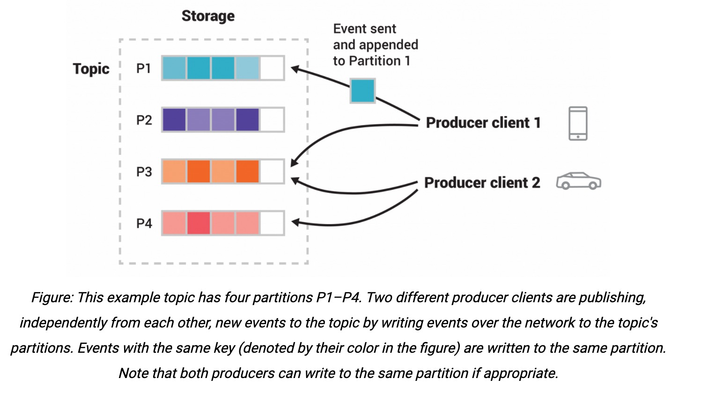

# What is event streaming?
Technically speaking, event streaming is the practice of capturing data in real-time from event sources like databases, sensors, mobile devices, cloud services, and software applications in the form of streams of events; storing these event streams durably for later retrieval; manipulating, processing, and reacting to the event streams in real-time as well as retrospectively; and routing the event streams to different destination technologies as needed. Event streaming ensures a continuous flow and interpretation of data so that the right information is at the right place, at the right time.

# What is Kafka?
Kafka is an event streaming platform. Kafka combines three key capabilities so you can implement your use cases for event streaming end-to-end with a single battle-tested solution:
- to publish and subscribe to streams of events, including continuous import/export of your data from other systems
- to store streams of events durably and reliably for as long as you want
- to process streams of events as they occur or retrospectively

All of these functionality is provided in a distributed, highly scalable, elastic, fault-tolerant, and secure manner.

# How does Kafka work in a nutshell?
Kafka is a distributed system consisting of **servers** and **clients** that communicate via a high-performance TCP network protocol.

Servers: Kafka is run as a cluster of one or more servers that can span multiple datacenters or cloud regions. Some of these servers form the storage layer, called the brokers. Other servers run **Kafka Connect** to continuously import and export data as event streams to integrate Kafka with your existing systems such as relational databases as well as other Kafka clusters. To let you implement mission-critical use cases, a Kafka cluster is highly scalable and fault-tolerant: if any of its servers fails, the other servers will take over their work to ensure continuous operations without any data loss.

Clients: they allow you to write distributed applications and microservices that read, write, and process streams of events in parallel, at scale, and in a fault-tolerant manner even in the case of network problems or machine failures.

# Main concepts and terminology
An **event** records the fact that "something happened" in the world or in your business. It is also called record or message in the documentation. When you read or write data to Kafka, you do this in the form of events. Conceptually, an event has a key, value, timestamp, and optional metadata headers.

**Producers** are those client applications that publish events to Kafka, and **consumers** are those that subscribe to these events. In Kafka, producers and consumers are fully decoupled and agnostic of each other, which is a key design element to achieve the high scalability that Kafka is known for.

Events are organized and durably stored in **topics**. Very simplified, a topic is similar to a folder in a filesystem, and the events are the files in that folder. Topics in Kafka are always multi-producer and multi-subscriber: a topic can have zero, one, or many producers that write events to it, as well as zero, one, or many consumers that subscribe to these events. Events in a topic can be read as often as needed, unlike traditional messaging systems, events are not deleted after consumption. Instead, you define for how long Kafka should retain your events through a per-topic configuration setting, after which old events will be discarded. Kafka's performance is effectively constant with respect to data size, so storing data for a long time is perfectly fine.

Topics are **partitioned**, meaning a topic is spread over a number of buckets located on different Kafka brokers. This distributed placement of your data is very important for scalability because it allows client applications to both read and write the data from/to many brokers at the same time. When a new event is published to a topic, it is actually appended to one of the topic's partitions. Events with the same event key are written to the same partition, and Kafka guarantees that any consumer of a given topic-partition will always read that partition's events in exactly the same order as they were written.

To make your data fault-tolerant and highly-available, every topic can be **replicated**, even across geo-regions or datacenters, so that there are always multiple brokers that have a copy of the data just in case things go wrong, you want to to maintenance on the brokers, and so on. A common production setting is a replication factor of 3, so that there will always be three copies of your data. The replication is performed at the level of topic-partitions.

# Kafka APIs
- Producer API, allows applications to send streams of data to topics in the Kafka cluster
- Consumer API, allows applications to read streams of data from topics in the Kafka cluster
- Streams API, allows transforming streams of data from input topics to output topics
- Connect API, allows implementing connectors that continually pull from some source system or application into Kafka or push from Kafka into some sink system or application
- Admin API, allows managing and inspecting topics, brokers, and other Kafka objects

# Use Cases
- messaging, Kafka works well as a replacement for a more traditional message broker
- website activity tracking
- metrics
- log aggregation
- stream processing
- event sourcing
- commit log