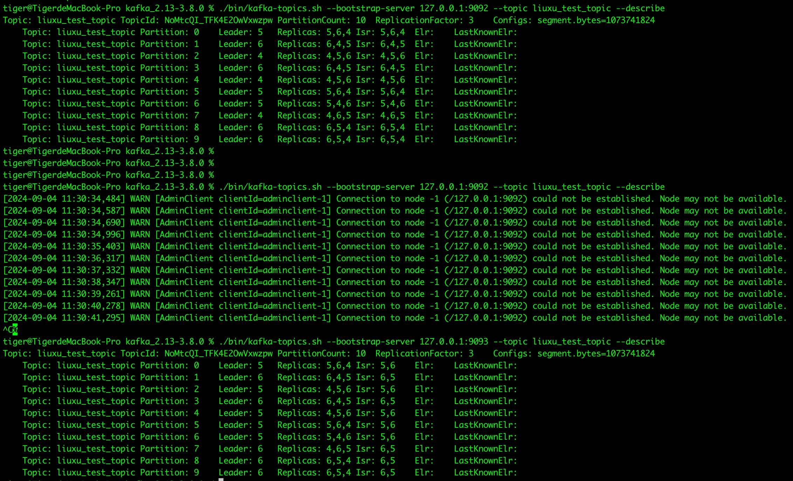

# Common Commands
```sh
# generate a cluster UUID
bin/kafka-storage.sh random-uuid

# format log directories
bin/kafka-storage.sh format -t xxxcluster_uuid -c config/kraft/server.properties

# start the Kafka server
bin/kafka-server-start.sh config/kraft/server.properties

# list topisc
bin/kafka-topics.sh --list --bootstrap-server localhost:9092

# write events
bin/kafka-console-producer.sh --topic liuxu_kafka_test --bootstrap-server localhost:9092

# read events
bin/kafka-console-consumer.sh --topic liuxu_kafka_test --bootstrap-server localhost:9092 --from-beginning
```

## create topic
```sh
bin/kafka-topics.sh --bootstrap-server localhost:9092 --create --topic my_topic_name \
--partitions 20 --replication-factor 3 --config x=y
```
The replication factor controls how many servers will replicate each message that is written. If you have a replication factor of 3 then up to 2 servers can fail before you will lose access to your data. We recommend you use a replication factor of 2 or 3 so that you can transparently bounce machines without interrupting data consumption.

The partition count controls how many logs the topic will be sharded into. There are several impacts of the partition count. First each partition must fit entirely on a single server. So if you have 20 partitions the full data set (and read and write load) will be handled by no more than 20 servers (not counting replicas). Finally the partition count impacts the maximum parallelism of your consumers.

Each sharded partition log is placed into its own folder under the Kafka log directory. The name of such folders consists of the topic name, appended by a dash, and the partition id. Since a typical folder name can not be over 255 characters long, there will be a limitation on the length of topic names. We assume the number of partitions will not ever be above 100,000. Therefore, topics name connot be longer than 249 characters. This leaves just enough room in the folder name for a dash and a potentially 5 digit long partition id.

## topic info 
```sh
bin/kafka-topics.sh --bootstrap-server localhost:9092 --topic my_topic_name --describe 
```

## add topic partitions
```sh
bin/kafka-topics.sh --bootstrap-server localhost:9092 --topic my_topic_name --alter --partitions 40
```

## graceful shutdown
The Kafka cluster will automatically detect any broker shutdown or failure and elect new leaders for the partitions on that machine. This will occur whether a server fails or its brought down intentionally for maintenance or configuration changes. For the latter case Kafka supports a more graceful mechanism for stopping a server than just killing it. When a server is stopped gracefully it has two optimizations it will take advantage of:
- it will sync all its logs to disk to avoid needing to do any log recovery when it restarts (i.e. validating the checksum for all messages in the tail of the log). Log recovery takes time so this speeds up intentional restarts
- it will migrate any partitions the server is the leader for to other replicas prior to shutting down. This will make the leadership transfer faster and minimize the time each partition is unavailable to a few millseconds

Syning the logs will happen automatically whenever the server is stopped other than by a hard kill, but the controlled leadership migration requires using a special setting: **controlled.shutdown.enable** must be true. Also, note that controlled shutdown will only succeed if all the partitions hosted on the broker have replicas (i.e. the replication factor is greater than 1 and at least one of these replicas is alive). This is generally what you want since shutting down the last replica would make that topic partition unavilable.

