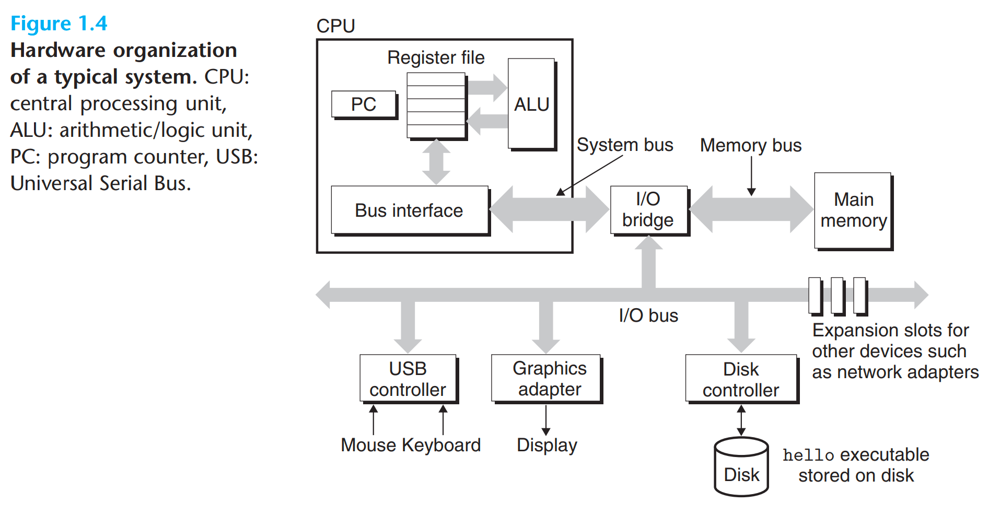

All information in a system is represented as a bunch of bits. The only thing that distinguishes different data objects is the context in which we view them.

# Compilation System
- preprocessing phase
```
hello.c --> hello.i
```

- compilation phase
```
hello.i --> hello.s
```

Assembly language is useful because it provides a common output language for different compilers for different high-level languages.

- assembly phase
```
hello.s --> hello.o
```
The assembler translates **hello.s** into machine-language instructions, packages them in a form known as a *relocatable object program*, and stores the result in the object file **hello.o**. 

- linking phase
```
hello.o --> hello
```
The **printf** function resides in a separate precompiled object file called **printf.o**, which must somehow be merged with our **hello.o** program. The linker handles this merging. The result is an executable object file that is ready to be loaded into memory and executed by the system.

# Hardware Organization of a System


Running throughout the system is a collection of electrical conduits called *buses* that carry bytes of information back and forth between the components. Buses are typically designed to transfer fixed-size chunks of bytes known as *words*.

I/O devices are the system's connection to the external world. Each I/O device is connected to the I/O bus by either a *controller* or an *adapter*. The purpose of a *controller* or an *adapter* is to transfer information back and forth between the I/O bus and an I/O device.

The *main memory* is a temporary storage device that holds both a program and the data it manipulates while the processor is executing the program. Physically, main memory consists of a collection of *dynamic random access memory* (DRAM) chips. Logically, memory is organized as a linear array of bytes, each with its own unique address (array index) starting at zero.

The *central processing unit* (CPU), or simply *processor*, is the engine that interprets (or executes) instructions stored in main memory. At its core is a word-size storage device (or *register*) called the *program counter* (PC). At any point in time, the PC points at some machine-language instruction in main memory.

