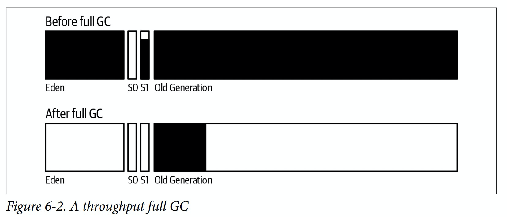

# Garbage Collection Overview

One of the most attractive features of programming in Java is that developers needn't explicitly manage the life cycle of objects: objects are created when needed, and when the object is no longer in use, the JVM automatically frees the object.

At a basic level, GC consists of finding objects that are in use and freeing the memory associated with the remaining objects (those that are not in use). 

The JVM must periodically search the heap for unused objects. It does this by starting with objects that are GC roots, which are objects that are accessible from outside the heap. That primarily includes thread stacks and system classes. Those objects are always reachable, so then the GC algorithm scans all objects that are reachable via one of the root objects. Objects that are reachable via a GC root are live objects; the remaining unreachable objects are garbage (even if they maintain references to live objects or to each other).

When the GC algorithm finds unused objects, the JVM can free the memory occupied by those objects and use it to allocate additional objects. However, it is usually insufficient simply to keep track of that free memory and use it for future allocations; at some point, memory must be compacted to prevent memory fragmentation.

It is simpler to perform these operations if no application threads are running while the garbage collector is running. When GC threads track object references or move objects around in memory, they must make sure that application threads are not using those objects. This is particularly true when GC moves objects around: the memory location of the object changes during that operation, and hence no application threads can be accessing the object. The pauses when all application threads are stopped are called *stop-the-world pauses*. These pauses generally have the greatest impact on the performance of an application, and minimizing those pauses is one important consideration when tuning GC.

# Generational Garbage Collectors

Most garbage collectors work by splitting the heap into generations. These are called the *old generation* and the *yound generation*. The young generation is further divided into sections known as *eden* and *survior spaces*.

The rationale for having separate generations is that many objects are used for a very short period of time. The garbage collector is designed to take advantage of the fact that many objects are only used temporarily. This is where the generational design comes in.

Objects are first allocated in the young generation, which is a subset of the entire heap. When the young generation fills up, the garbage collector will stop all the application threads and empty out the young generation. Objects that are no longer in use are discarded, and objects that are still in use are moved elsewhere. This operation is called a *minor GC* or *young GC*.

Because the young generation is only a portion of the entire heap, processing it is faster than processing the entire heap. The application threads are stopped for a much shorter period of time than if the entire heap were processed at once. It is almost always a big advantage to have the shorter pauses even though they will be more frequent.

Objects are allocated in eden (which encompasses the vast majority of the young generation). When the young generation is cleared during a collection, all objects in eden are either moved or discarded: objects that are not in use can be discarded, and objects in use are moved either to one of the survior spaces or to the old generation. Since all surviving objects are moved, the young generation is automatically compacted when it is collected: at the end of the collection, eden and one of the survior spaces are empty, and the objects that remain in the young generation are compacted within the other survior space.

As objects are moved to the old generation, eventually it too will fill up, and the JVM will need to find any objects within the old generation that are no longer in use and discard them. This is where GC algorithms have their biggest differences. The simpler algorithms stop all application threads, find the unused objects, free their memory, and then compact the heap. This process is called a *full GC*, and it generally causes a relatively long pause for the application threads. One the othre hand, it is possible, though more computationally complex, to find unused objects while application threads are running. Because the phase where they scan for unused objects can occur without stopping application threads, these algorithms are called *concurrent collectors*. When using a concurrent collector, an application will typically experience fewer (and much shorter) pauses. The biggest trade-off is that the application will use more CPU overall.

# Serial Garbage Collector

>
> -XX:+UseSerialGC
>

The *serial garbage collector* is the simplest of the collectors. 

The serial collector uses a single thread to process the heap. It will stop all application threads as the heap is processed (for either a minor or full GC). During full GC, it will fully compact the old generation.

# Throughput Garbage Collector

>
> -XX:+UseParallelGC
> 
> -XX:+UseParallelOldGC (obsolete)
> 

In JDK 8, the *throughput collector* is the default collector for any 64-bit machine with two or more CPUs.

The throughput collector uses multiple threads to collect the young generation, which makes minor GCs much faster than when the serial collector is used. It uses multiple threads to process the old generation as well. The throughput collector stops all application threads during both minor and full GCs, and it fully compacts the old generation during a full GC.

# G1 (Garbage First) Garbage Collector

>
> -XX:+UseG1GC
>

The *G1 garbage collector* uses a concurrent collection strategy to collect the heap with minimal pauses. It is the default collector in JDK 11 and later for 64-bit JVMs on machines with two or more CPUs. It is functional in JDK 8 as well, particularly in later builds of JDK 8.

G1 GC divides the heap into regions, but it still considers the heap to have two generations. Some of those regions make up the young generation, and the young generation is still collected by stopping all application threads and moving all objects that are alive into the old generation or the survior spaces. (This occurs using multiple threads).

In G1 GC, the old generation is processed by background threads that don't need to stop the application threads to perform most of their work. Because the old generation is divided into regions, G1 GC can clean up objects from the old generation by copying from one region into another, which means that it (at least partially) compacts the heap during normal processing. This helps keep G1 GC heaps from becoming fragmented, although that is still possible.

The trade-off for avoiding the full GC cycles is CPU time: the (multiple) background threads G1 GC uses to process the old generation must have CPU cycles available at the same time the application threads are running.

# CMS (Concurrent Mark Sweep) Garbage Collector

>
> -XX:+UseConcMarkSweepGC
> 
> -XX:+UseParNewGC (obsolete)
>

The *CMS garbage collector* was the first concurrent collector. Like other algorithms, CMS stops all application threads during a minor GC, which it performs with multiple threads.

CMS is officially deprecated in JDK 11 and beyond, and its use in JDK 8 is discouraged. From a practical standpoint, the major flaw in CMS is that it has no way to compact the heap during its background processing. If the heap becomes fragmented, CMS must stop all application threads and compact the heap, which defeats the purpose of a concurrent collector.

# Which One to Use

The choice of a GC algorithm depends in part on the hardware available, in part on what the application looks like, and in part on the performance goals for the application. In JDK 11, G1 GC is often the better choice; in JDK 8, the choice will depend on your application.

G1 GC is currently the better algorithm to choose for a majority of applications. The trade-off between G1 GC and other collectors involves having available CPU cycles for G1 GC background threads. When you choose G1 GC, sufficient CPU is needed for its background threads to run.

On a machine with a single CPU, the JVM defaults to use the serial collector. This includes virtual machines with one CPU, and Docker containers that are limited to one CPU. In these environments, the serial collector is usually a good choice, but at times G1 GC will give better results. 

The serial collector makes sense when running CPU-bounded applications on a machine with a single CPU, even if that single CPU is hyper-threaded. G1 GC will still be better on such hardware for jobs that are not CPU-bound.

One other point about the serial collector: an application with a very small heap (say, 100MB) may still perform better with the serial collector regardless of the number of cores that are available.

The throughput collector makes sense on multi-CPU machines running jobs that are CPU-bound. Even for jobs that are not CPU-bound, the throughput collector can be the better choice if it does relatively few full GCs or if the old generation is generally full.

# Basic GC Tuning

For many applications, the only tuning required is to select the appropriate GC algorithm and, if needed, to increase the heap size of the application. Adaptive sizing will then allow the JVM to autotune its behavior to provide good performance using the given heap.

## sizing the heap

>
> -Xms*N*
> 
> -Xmx*N*
>


**-Xms** specifies the initial heap size, and **-Xmx** specifies the maximum heap size.

The defaults vary depending on the operating system, the amount of system RAM, and the JVM in use. The goal of the JVM is to find a reasonable default initial value for the heap based on the system resources available to it, and to grow the heap up to a reasonable maximum if the application needs more memory (based on how much time it spends performing GC).

Like most performance issues, choosing a heap size is a matter of balance. The first rule in sizing a heap is to never to specify a heap that is larger than the amount of physical memory on the machine, and if multiple JVMs are running, that applies to the sum of all their heaps. You also need to leave some room for the native memory of the JVM, as well as some memory for other applications: typically, at least 1 GB of space for common OS profiles. A good rule of thumb is to size the heap so that it is 30% occupied after a full GC.

Having an initial and maximum size of the heap allows the JVM to tune its behavior depending on the workload. If the JVM sees that it is doing too much GC with the initial heap size, it will continually increase the heap until the JVM is doing the correct amount of GC, or until the heap hits its maximum size.

Be aware that automatic sizing of the heap occurs even if you explicitly set the maximum size: the heap will start at its default initial size, and the JVM will grow the heap in order to meet the performance goals of the GC algorithm. There isn't necessarily a memory penalty for specifying a larger heap than is needed: it will grow only enough to meet the GC performance goals.

If you know exactly what size heap the application needs, you may as well set both the initial and maximum values of the heap to that value (e.g., -Xms4096m, -Xmm4096m). That makes GC slightly more efficient, because it never needs to figure out whether the heap should be resized.

For applications that don't need a large heap, the heap size doesn't need to be set at all. Instead, you specify the performance goals for the GC algorithm: the pause time you are willing to tolerate, the percentage of time you want to spend in GC, and so on. Unless the application needs a larger heap than the default, consider tuning the performance goals of a GC algorithm rather than fine-tuning the heap size.

## sizing the generations

>
> -XX:NewRatio=*N*
>
> -XX:NewSize=*N*
>
> -XX:MaxNewSize=*N*
>
> -Xmn*N*
> 
> -XX:-UseAdaptiveSizePolicy
>
> -XX:+PrintAdaptiveSizePolicy

**-XX:NewRatio** sets the ratio of the old generation to the young generation, which has a default value of 2. It means the young generation starts out at 33% of the initial heap size.

**-XX:NewSize** sets the initial size of the young generation, it takes precedence over the value calculated from the **NewRatio**.

**-XX:MaxNewSize** sets the maximum size of the young generation. By default, the maximum is set using the **NewRatio** value, though it is based on the maximum heap size.

**-Xmn** is a shorthand for setting both **-XX:NewSize** and **-XX:MaxNewSize** to the same value.

**-XX:-UseAdaptiveSizePolicy** turns off the adaptive sizing.

**-XX:+PrintAdaptiveSizePolicy** sets the JVM to print the information of how the various generations were resized during a collection.

Once the heap size has been determined, the JVM must decide how much of the heap to allocate to the young generation and how much to allocate to the old generation. The JVM usually does this automatically and usually does a good job in determining the optimal ratio between young and old generations.

The performance implication of different generation sizes should be clear: if there is a relatively larger young generation, young GC pause times will increase, but the young generation will be collected less often, and fewer objects will be promoted into the old generation. But on the other hand, because the old generation is relatively smaller, it will fill up more frequently and do more full GCs.

The sizes of the heap, the generations, and the survivor spaces can vary during execution as the JVM attempts to find the optimal performance according to its policies and tunings. Adaptive sizeing should generally be kept enabled, since adjusting those generation sizes is how GC algorithms attempt to meet their pause-time goals. For finely tuned heaps, adaptive sizing can be disabled for a small performance boost.

## sizing metaspace

>
> -XX:MetaspaceSize=*N*
>
> -XX:MaxMetaspaceSize=*N*
> 

When the JVM loads classes, it must keep track of certain metadata about those classes. This occupies a separate heap space called the *metaspace*. Information in the metaspace is used only by the compiler and JVM runtime, and the data it holds is referred to as *class metadata*.

There isn't a good way to calculate in advance the amount of space a particular program needs for its metaspace. The size will be proportional to the number of classes it uses, so bigger applications will need bigger areas.

The metaspace behaves similarly to a separate instance of the regular heap. It is sized dynamically based on a initial size and will increase as needed to a maximum size.

Resizing the metaspace requires a full GC, so it is an expensive operation. If there are a lot of full GCs during the startup of a program (as it is loading classes), it is often because metaspace is being resized, so increasing the initial size is a good idea to improve startup in that case. Servers, for example, typically specify an initial metaspace size of 128 MB, 192 MB, or more.

Java classes can be eligible for GC just like anything else. This is a common occurrence in an application server, which creates new classloaders every time an application is deployed (or redeployed). The old classloaders are then unreferenced and eligible for GC, as are any classes that they defined. Meanwhile, the new classes of the application will have new metadata, and so there must be room in the metaspace for that. This often causes a full GC because the metaspace needs to grow (or discard old metadata).

## controlling parallelism

>
> -XX:ParallelGCThreads=*N*
>

Because many GC operations stop all application threads from executing, the JVM attempts to use as many CPU resources as it can in order to minimize the pause time. By default, the JVM will run one thread for each CPU on machine, up to eight. Once that threshold has been reached, the JVM adds a new thread for only every 1.6 CPUs.

If more than one JVM is running on the machine, it is a good idea to limit the total number of GC threads among all JVMs.

# GC Log

The best way to see the effect that GC has on the performance of an application is to become familiar with the GC log, which is a record of every GC operation during the program's execution.

The key information needed to tune an individual collector is the data from the GC log when that collector is enabled.

## GC logging in JDK 8

>
> -Xloggc:*filename*
> 
> -verbose:gc
> 
> -XX:+PrintGC
> 
> -XX:+PrintGCDetails
> 
> -XX:+PrintGCTimeStamps
> 
> -XX:+PrintGCDateStamps
> 
> -XX:+UseGCLogFileRotation
> 
> -XX:NumberOfGCLogFiles=*N*
> 
> -XX:GCLogFileSize=*N*
> 

# GC Tools

For real-time monitoring of the heap, use **jvisualvm** or **jconsole**.

For a scriptable solution, **jstat** is the tool of choice. **jstat** provides nine options to print different information about the heap. One useful option is **-gcutil**, which displays the time spent in GC as well as the percentage of each GC area that is currently filled.

```bash
jstat -gcutil 20527 1000
```

# Throughput Garbage Collector Details


A young collection occurs when eden has filled up. The young collection moves all objects out of eden: some are moved to one of the survivor spaces, and some are moved to the old generation. Of course, many objects are discarded because they are no longer referenced.



The old collection frees everything out of the young generation. The only objects that remain in the old generation are those that have active references, and all of those objects have been compacted so that the beginning of the old generation is occupied, and the remainder is free.

Tuning the throughput collector is all about pause times and striking a balance between the overall heap size and the sizes of the old and young generations. It is possible to run experiments on any application and determine the best sizes for the heap and for the generations, but it is often easier to let the JVM make those decisions, which is what usually happens, since adaptive sizing is enabled by default.

>
> -XX:MaxGCPauseMillis=*N*
> 
> -XX:GCTimeRatio=*N*
> 

The **MaxGCPauseMillis** flag specifies the maximum pause time that the application is willing to tolerate. If a very small value is used, the application will end up with a very small old generation. That will cause the JVM to perform very, very frequent full GCs, and performance will be dismal. So be realistic: set the value to something that can be achieved. By default, this flag is not set.

The **GCTimeRatio** flag specifies the amount of time you are willing for the application to spend in GC (compared to the amount of time its application-level threads should run). The default value for *GCTimeRatio* is 99, which means the goal is 1% time in GC. If you want 5% time in GC, set *GCTimeRatio* to 19.

The JVM uses these two flags to set the size of the heap with the boundaries established by the initial and maximum heap sizes. The **MaxGCPauseMillis** flag takes precedence: if it is set, the sizes of the young and old generations are adjusted until the pause-time goal is met. Once that happens, the overall size of the heap is increased until the time-ratio goal is met. Once both goals are met, the JVM will attempt to reduce the size of the heap so that it ends up with the smallest possible heap that meets these two goals.

# CMS Garbage Collector Details

CMS has three basic operations:

*   collecting the young generation (stopping all application threads)
*   running a concurrent cycle to clean data out of the old generation
*   performing a full GC to compact the old generation, if necessary


A CMS young collection is similar to a throughput young collection: data is moved from eden into the survivor space (and into the old generation if the survivor space fills up).


CMS starts a concurrent cycle based on the occupancy of the heap. When it is sufficiently full, the background threads that cycle through the heap and remove objects are started. Notice that the old generation is not compacted: there are areas where objects are allocated, and free areas. When a young collection moves objects from the eden into the old generation, the JVM will attempt to use those free areas to hold the objects. Often these objects won't fit into one of the free areas, which is why after the CMS cycle, the high-water mark of the heap is larger.

In the GC log, the concurrent cycle appears as a number of phases. Alghough a majority of the concurrent cycle uses background threads, some phases introduce short pauses where all application threads are stopped.

## concurrent mode failure

When a young collection occurs and there isn't enough room in the old generation to hold all the objects that are expected to be promoted, CMS executes what is essentially a full GC. All application threads are stopped, and the old generation is cleaned of any dead objects. This operation is single-threaded, and it takes long time. The concurrent mode failure is a major reason CMS is deprecated.

## promotion failure

When there is enough room in the old generation to hold the promoted objects but the free space is fragmented and so the promotion fails. As a result, in the middle of the young collection (when all threads were already stopped), CMS collected and compacted the entire heap. The time is much longer than when CMS had a concurrent mode failure because the entire heap was compacted; the concurrent mode failure simply free objects in the old generation.

## full GC without concurrent cycle

This occurs when the metaspace has filled up and needs to be collected. CMS does not collect the metaspace, so if it fills up, a full GC is needed to discard any unreferenced classes.

## tuning CMS GC

The primary concern when tuning CMS is to make sure that no concurrent mode or promotion failures occur.

We can attempt to avoid this failure in multiple ways:
*   the simplest way to avoid those failures (when possible) is to increase the size of the heap
*   otherwise, the next step is to start the concurrent background threads sooner
*   tuning the number of background threads can also help

> 
> -XX:CMSInitiatingOccupancyFraction=*N*
> 
> -XX:+UseCMSInitiatingOccupancyOnly
> 

By default, the **UseCMSInitiatingOccupanceOnly** flag is false, and CMS uses a more complex algorithm to determine when to start the background threads. The default value for **CMSInitiatingOccupanceFraction** is 70. The temptation is to set the value to 0 or another small number so that the background CMS cycle runs all the time. That is usually discouraged, but as long as you are aware of the trade-offs being made, it may work out fine. 

>
> -XX:ConcGCThreads=*N*
> 

If an application experiences a concurrent mode failure and extra CPU cycles are avaiable, the number of those background threads can be increased by setting the **ConcGCThreads** flag.