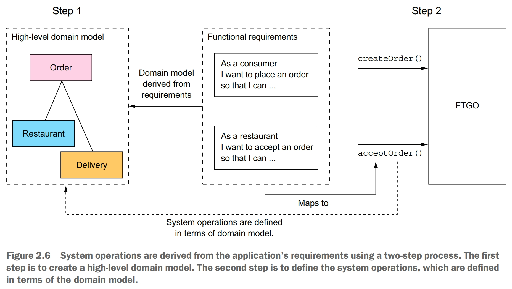

A three-step process for decomposition:
- Identify system operations
- Identify services
- Define service APIs and collaborations

# Identify system operations
A two-step process: The first step creates the high-level domain model consisting of the key classes that provide a vocabulary with which to describe the system operations. The second step identifies the system operations and describes each one's behavior in terms of the domain model.

The domain model is derived primarily from the nouns of the user stories, and the system operations are derived mostly from the verbs. A system operation can create, update or delete domain objects, as well as create or destroy relationships between them.

# Decompose by business capability
One strategy for creating a microservice architecture is to decompose by business capability. An organization's business capabilities capture what an organization's business is. They are generally stable, as opposed to how an organization conducts its business, which changes over time, sometimes dramatically.

Once you've identified the business capabilities, you then define a service for each capability or group of related capabilities. A key benefit of organizing services around capabilities is that because they're stable, the resulting architecture will also be relatively stable. The individual components of the architecture may evolve as the how aspect of the business changes, but the architecture remains unchanged.

# Decompose by DDD subdomains
DDD is quite different from the traditional approach to enterprise modeling, which creates a single model for the entire enterprise. In such a model there would be, for example, a single definition of each business entity, such as consumer, order, and so on. The problem with this kind of modeling is that getting different parts of an organization to agree on a single model is a monumental task. Also, it means that from the perspective of a given part of the organization, the model is overly complex for their needs. Moreover, the domain model can be confusing because different parts of the organization might use either the same term for different concepts or different terms for the same concept. DDD avoids these problems by defining multiple domain models, each with an explicit scope.

A subdomain is a part of the *domain*, DDD's term for the application's problem space. DDD defines a separate domain model for each subdomain. 

DDD calls the scope of a domain model a *bounded context*. A bounded context includes the code artifacts that implement the model. When using the microservice architecture, each bounded context is a service or possibly a set of services.

DDD and the microservice architecture are in almost perfect alignment. The DDD concept of subdomains and bounded contexts maps nicely to services within a microservice architecture. Also, the microservice architecture's concept of autonomous teams owning services is completely aligned with the DDD's concept of each domain model being owned and developed by a single team.

# Obstables to decomposing an application into services
There are several obstacles to decomposition:
- network latency
- reduced avaiability due to synchronous communciation
- maintaining data consistency across services
- obtaining a consistent view of the data
- god classes preventing decomposition

Network latency is an ever-present concern in a distributed system. You might discover that a particular decomposition into services results in a large number of round-trips between services. Sometimes, you can reduce the latency to an acceptable amount by implementing a batch API for fetching multiple objects in a single round trip. But in other situations, the solution is to combine services, replacing expensive IPC with language-level method or function calls.

One obstacle to decomposition is that synchronous communication between services reduces availability. Using asynchronous messaging, which eliminates tight coupling and improves avaiability, is often a better choice.

One obstacle to decomposition is the requirement to maintain data consistency across services. The traditional solution is to use a two-phase, commit-based, distributed transaction management mechanism. But you'll see that this is not a good choice for modern applications, and you must use a very different approach to transaction management: a saga. A *saga* is a sequence of local transactions that are coordinated using messaging. Sagas are more complex than traditional ACID transactions but they work well in many situations.

One obstacle to decomposition is the inability to obtain a truly consistent view of data across multiple databases. In a microservice architecture, even though each service's database is consistent, you can't obtain a globally consistent view of the data.

One obstacle to decomposition is so-called god classes, which are used throughout an application. A god class typically implements business logic for many different aspects of the application. It normally has a large number of fields mapped to a database table with many columns. Because a god class bundles together state and behavior for many different aspects of an application, it is an insurmountable obstacle to splitting any business logic that uses it into services. A solveable approach is to apply DDD and treat each service as a separate subdomain with its own domain model.

# Defining service APIs
The starting point for defining the service APIs is to map each system operation to a service. After that, we decide whether a service needs to collaborate with others to implement a system operation. If collaboration is required, we then determine what APIs those other services must provide in order to support the collaboration.