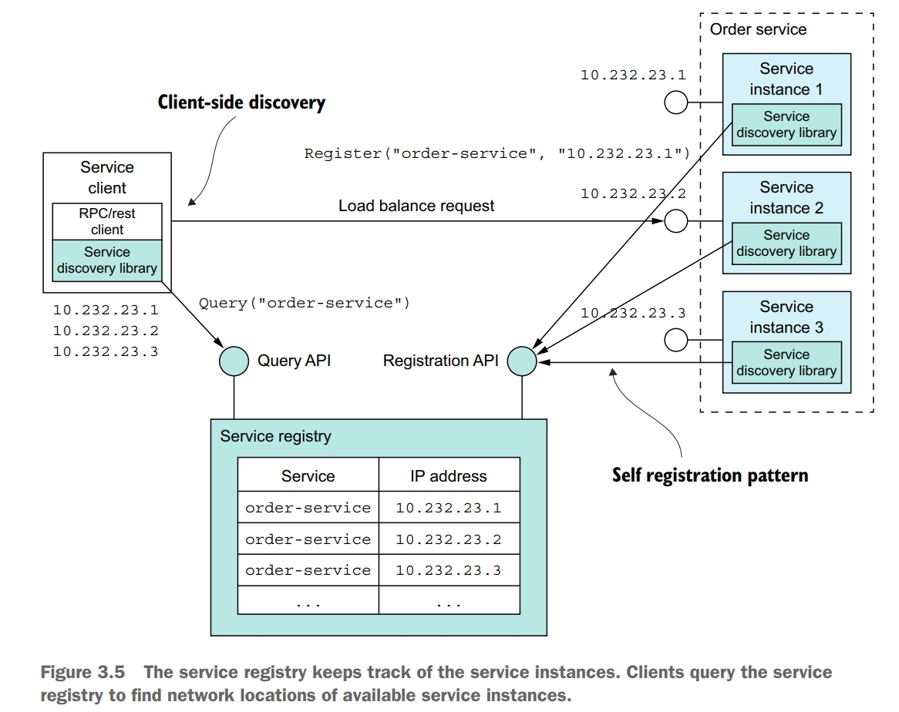
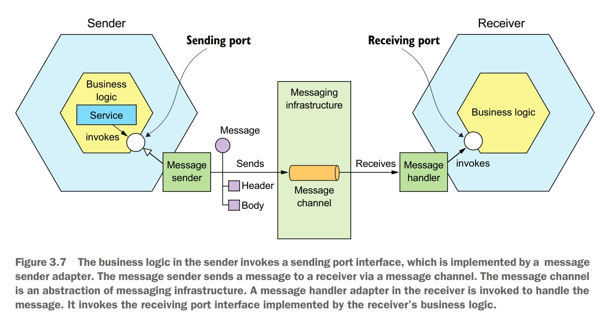
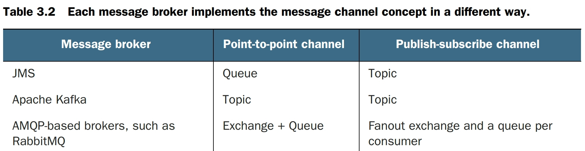
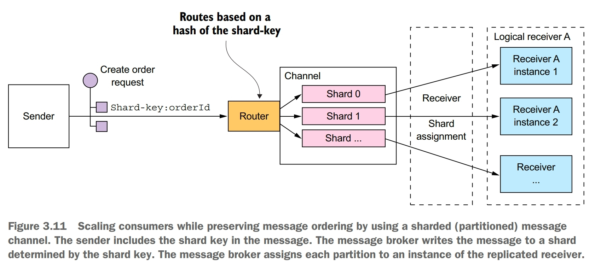
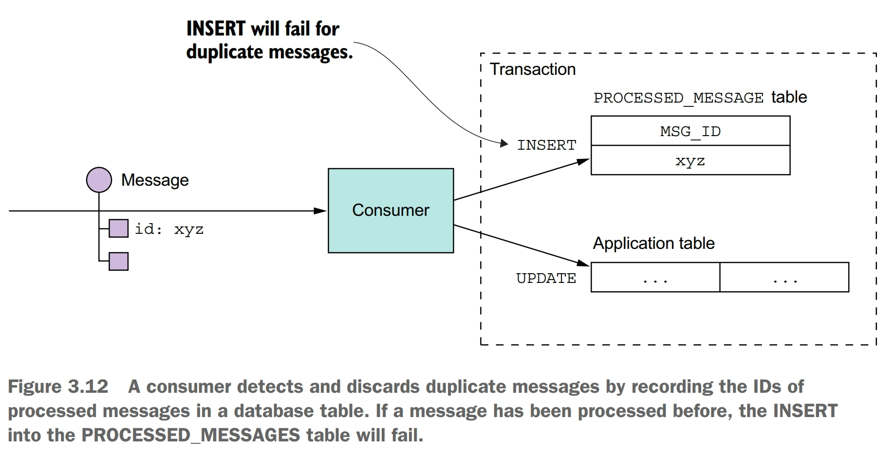
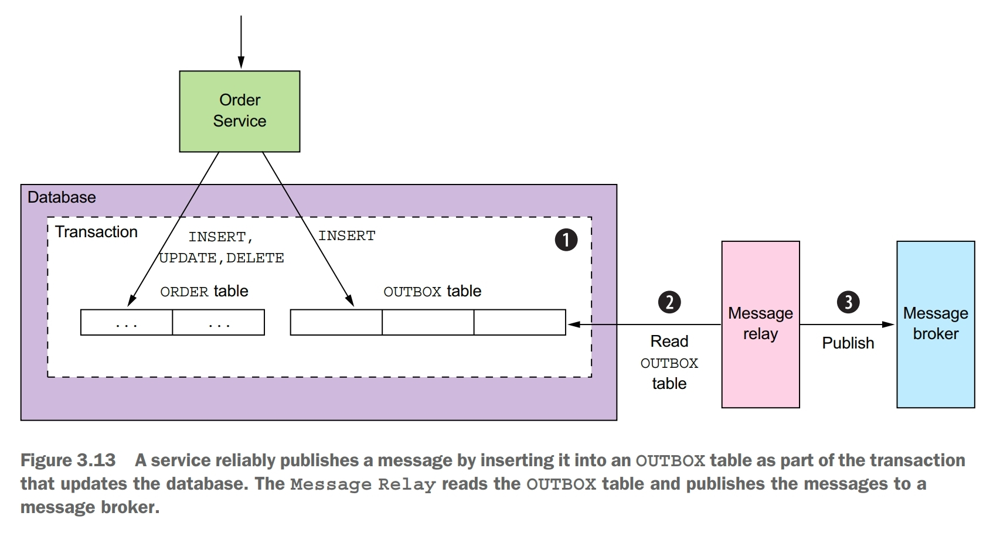
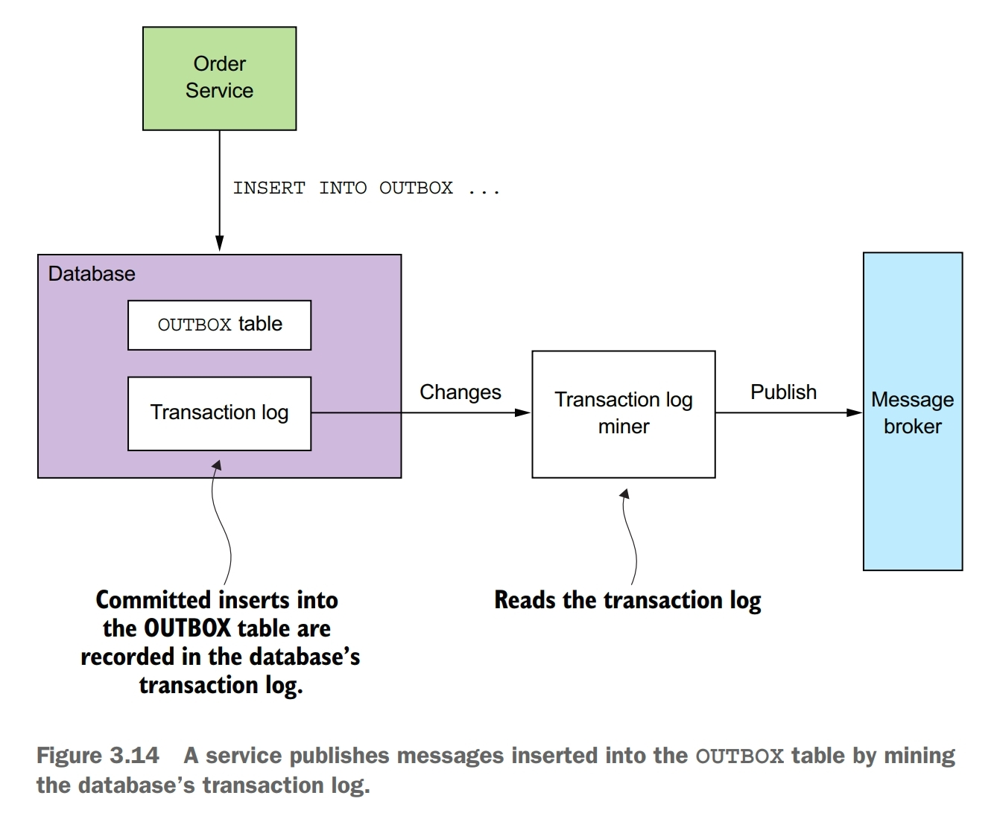
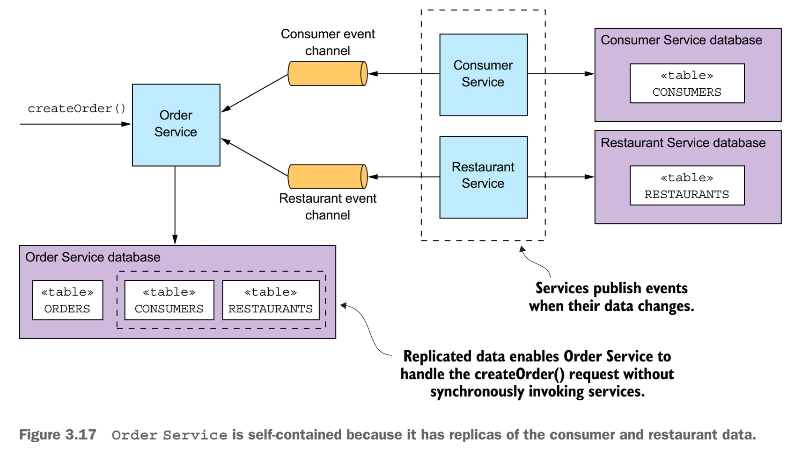
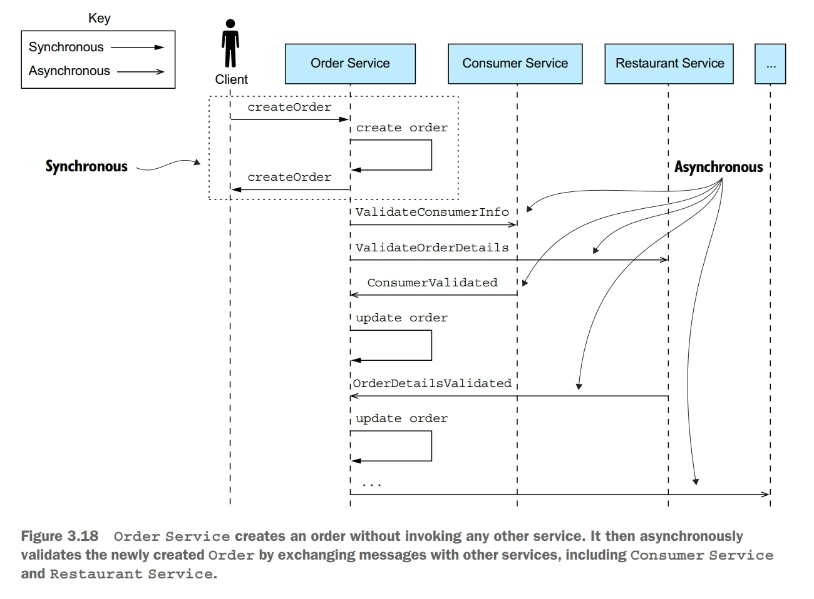

The microservice architecture structures an application as a set of services. Those services must often collaborate in order to handle a request. Because service instances are typically processes running on multiple machines, they must interact using IPC. It plays a much more important role in a microservice architecture than it does in a monolithic application.

The choice of IPC mechanism is an important architectural decision. It can impact application availability and it also intersects with transaction management. A favored architecture is an architecture consisting of loosely coupled services that communicate with one other using asynchronous messaging. Synchronous protocols such as REST are used mostly to communicate with other applications.

Regardless of which IPC mechanism you choose, it is important to precisely define a service's API using some kind of *interface definition language* (IDL).

# Interaction Styles
Interaction styles can be categorized in two dimensions. The first dimension is whether the interaction is one-to-one or one-to-many. The second dimension is whether the interaction is synchronous or asynchronous.

# Evolving APIs
APIs invariably change over time as new features are added, existing features are changed, and old features are removed. In a microservices-based application, changing a service's API is a lot more difficult. A service's clients are other services, which are often developed by other teams. The clients may even be other applications outside of the organization. You usually can't force all clients to upgrade in lockstep with the service. Also, because modern applications are usually never down for maintenance, you'll typically perform a rolling upgrade of your service, so both old and new versions of a service will be running simultaneously.

The Semantic Versioning specification is a useful guide to versioning APIs. It is a set of rules that specify how version numbers are used and incremented. The Semantic Versioning specification requires a version number to consist of three parts: MAJOR.MINOR.PATCH. You must increment each part of a version number as follows:
- MAJOR: when you make an incompatible change to the API
- MINOR: when you make backward-compatible enhancements to the API
- PATCH: when you make a backward-compatible bug fix

# Message formats
The essence of IPC is the exchange of messages. Messages usually contain data, and so an important design decision is the format of that data. It is essential to use a cross-language message format.

There are two main categories of message formats: text and binary. The advantages of text-based formats such as JSON and XML are not only human readable, but also self describing. A downside of using a text-based message format is that the messages tend to be verbose. Another drawback is the overhead of parsing text, especially when messages are large. Consequently, if efficiency and performance are important, you may want to consider using a binary format.

# RPI (Remote Procedure Invocation)
When using a remote procedure invocation-based IPC mechanism, a client sends a request to a service, and the service processes the request and sends back a response. The client assumes that the response will arrive in a timely fashion. Some clients may block waiting for a response, and others might have a reactive, non-blocking architecture.

## REST
REST is an IPC mechanism that (almost always) uses HTTP. A key concept in REST is a *resource*, which typically represents a single business object, such as a Consumer or Product, or a collection of business objects. REST uses the HTTP verbs for manipulating resources, which are referenced using a URL.

A REST maturity model:
- level 0: clients of a level 0 service invoke the service by making HTTP POST requests to its sole URL endpoint. Each request specifies the action to perform, the target of the action, and any parameters
- level 1: a level 1 service supports the idea of resources. To perform an action on a resource, a client makes a POST request that specifies the action to perform and any parameters
- level 2: a level 2 service uses HTTP verbs to perform actions. GET to retrieve, POST to create, and PUT to update. The request query parameters and body, if any, specify the action's parameters. This enables services to use web infrastructure such as caching for GET requests
- level 3: the design of a level 3 service is based on the HATEOAS (Hypertext As the Engine Of Application State) principle. The basic idea is that the representation of a resource returned by a GET request contains links for performing actions on that resource. The benefits of HATEOAS include no longer having to hard-wire URLs into client code

The most popular REST IDL is the Open API Specification, which evolved from the Swagger open source project. The Swagger project is a set of tools for developing and documenting REST APIs.

One common REST API design problem is how to map the operations you want to perform on a business object to an HTTP verb. A REST API should use PUT for updates, but there may be multiple ways to update an order, including cancelling it, revising the order, and so on. Also, an update might not be idempotent, which is a requirement for using PUT. The problem with mapping operations to HTTP verbs has led to the growing popularity of alternatives to REST, such as gRPC.

## gRPC
gRPC is a framework for writing cross-language clients and servers. You define your gRPC APIs using a Protocol Buffers-based IDL, which is Google's language-neutral mechanism for serializing structured data. You use the Protocol Buffer compiler to generate client-side stubs and server-side skeletons. Clients and servers exchange binary messages in the Protocol Buffers format using HTTP/2.

A gRPC API consists of one or more services and request/response message definitions. As well as supporting simple request/response RPC, gRPC support streaming RPC. A server can reply with a stream of messages to the client. Alternatively, a client can send a stream of messages to the server.

## service discovery
Service instances have dynamically assigned network locations. Moreover, the set of service instances changes dynamically because of autoscaling, failures, and upgrades. Consequently, your client code must use a service discovery.

Service discovery is conceptually quite simple: its key component is a service registry, which is a database of the network locations of an application's service instances. The service discovery mechanism updates the service registry when service instances start and stop. When a client invokes a service, the service discovery mechanism queries the service registry to obtain a list of available service instances and routes the request to one of them.

One way to implement service discovery is for the application's services and their clients to interact with the service registry. A service instance registers itself with the service registry. A service client retrieves the list of available instances from the service registry and load balances across them. 

Application-level service discovery has been popularized by Netflix and Pivotal. Netflix developed and open sourced several components: Eureka, a highly avaiable service registry, the Eureka Java client, and Ribbon, a sophisticated HTTP client that supports the Eureka client. Pivotal developed Spring Cloud, a Spring-based framework that makes it remarkably easy to use the Netflix components. Spring Cloud-based services automatically register with Eureka, and Spring Cloud-based clients automatically use Eureka for service discovery.

One benefit of application-level service discovery is that it handles the scenario when services are deployed on multiple deployment platforms. One drawback of application-level service discovery is that you need a service discovery library for every language, and possibly framework, that you use. Another drawback of application-level service discovery is that you're responsible for setting up and managing the service registry, which is a distraction.

Many modern deployment platforms such as Docker and Kubernetes have a built-in registry and service discovery mechanism. Service instances are automatically registered with the service registry by a third party. A client makes a request to a router, which is responsible for service discovery. The key benefit of platform-provided service discovery is that all aspects of service discovery are entirely handled by the deployment platform. Neither the instances nor the clients contain any service discovery code. Consequently, the service discovery mechanism is readily available to all services and clients regardless of which language or framework they're written in. One drawback of platform-provided service discovery is that it only supports the discovery of services that have been deployed using the platform.

## partial failre
It is essential that you design your services to prevent partial failures from cascading throughout the application. There are two parts to the solution:
- you must use RPI proxies to handle unresponsive remote services
- you need to decide how to recover from a failed remote service

Whenever one service synchronously invokes another service, it should protect itself using the following approachs:
- network timeouts: never block indefinitely and always use timeouts when waiting for a response. Using timeouts ensures that resources are never tied up indefinitely
- limiting the number of outstanding requests from a client to a service: impose an upper bound on the number of outstanding requests that a client can make to a particular service. If the limit has been reached, it's probably pointless to make additional requests, and those attempts should fail immediately
- circuit breaker pattern: track the number of successful and failed requests, and it the error rate exceeds some threshold, trip the circuit breaker so that further attempts fail immediately. A large number of requests failing suggests that the service is unavailable and that sending more requests is pointless. After a timeout period, the client should try again, if successful, close the circuit pattern

Netflix Hystrix is an open source library that implements these and other patterns. If you are using the JVM, you should definitely consider using Hystrix when implementing RPI proxies. And if you're running in a non-JVM environment, you should use an equivalent library.

You must also decide on a case-by-case basis how your services should recover from an unresponsive remote service. One option is for a service to simply return an error to its client. In other scenarios, returning a fallback value, such as either a default value or a cached response, may make sense.

# Messaging
A typical model of messaging is that messages are exchanged over message channels. A sender writes a message to a channel, and a receiver reads messages from a channel. 

A message consists of a header and a message body. The *header* is a collection of name-value pairs, metadata that describes the data being sent. The message *body* is the data being sent, in either text or binary format.

A *message channel* is an abstraction of the messaging infrastructure. There are two kinds of channels: point-to-point and publish-subscribe. A point-to-point channel delivers a message to exactly one of the consumers that is reading from the channel. A publish-subscribe channel delivers each message to all of the attached consumers.

## message broker
A messaging-based application typically uses a *message broker*, an infrastructure service through which the service communicates. A sender writes the message to the message broker, and the message broker delivers it to the receiver.

When selecting a message broker, you have various factors to consider, including the following:
- supported programming languages: you probably should pick one that supports a variety of programming languages
- supported messaging standards: does the message broker support any standards, such as AMQP and STOMP, or is it proprietary?
- messaging ordering: does the message broker preserve ordering of messages?
- delivery guarantees: what kind of delivery guarantees does the broker make?
- persistence: are messages persisted to disk and able to survive broker crashes?
- durability: if a consumer reconnects to the message broker, will it receive the messages that were sent while it was disconnected?
- scalability: how scalable is the message broker?
- latency: what is the end-to-end latency?
- competing consumers: does the message broker support competing consumers?

There are many message brokers to choose from. Examples of popular open source message brokers include the following: ActiveMQ, RabbitMQ, and Apache Kafka. Each message broker implements the message channel concept in a different way.

Which kind of message broker is the best fit depends on your application's requirement. It is even possible that different parts of your application will have different messaging requirements.

There are some downsides to using broker-based messaging:
- potential performance bottleneck: there is a risk that the message broker could be a performance bottleneck. Fortunately, many modern message brokers are designed to be highly scalable
- potential single point of failure: it is essential that the message broker is highly available, otherwise, system reliability will be impacted. Fortunately, most modern brokers have been designed to be highly avaiable
- additional operational complexity: the messaging system is yet another system component that must be installed, configured, and operated

## competing receivers and message ordering
One challenge is how to scale out message receivers while preserving message ordering. It is a common requirement to have multiple instances of a service in order to process messages concurrently. Moreover, even a single service instance will probably use threads to concurrently process multiple messages. The challenge with processing messages concurrently is ensuring that each message is processed once and in order.

A common solution, used by modern message brokers like Apache Kafka, is to use *sharded* (partitioned) channel.
- a sharded channel consists of two or more shards, each of which behaves like a channel
- the sender specifies a shard key in the message's header, which is typically an arbitrary string or sequence of bytes. The message broker uses a shard key to assign the message to a particular shard/partition
- the message broker groups together multiple instances of a receiver and treats them as the same logical receiver. Apache Kafka, for example, uses the term *consumer group*. The message broker assigns each shard to a single receiver. It reassigns shards when receivers start up and shut down.

## duplicate messages
Another challenge you must tackle when using messaging is dealing with duplicate messages. A message broker should ideally deliver each message only once, but guaranteeing exactly-once messaging is usually too costly. Instead, most message brokers promise to deliver a message *at least* once.

When the system is working normally, a message broker that guarantees at-least-once delivery will deliver each message only once. But a failure of a client, network, or message broker can result in a message being delivered multiple times.

There are some ways to handle duplicate messages:
- write idempotent message handlers
- track messages and discard duplicates

If the application logic that processes messages is idempotent, then duplicate messages are harmless. Unfortunately, application logic is often not idempotent.

Another simple solution is for a message consumer to track the messages that it has processed using the *message id* and discard any duplicates.

Another option is for a message handler to record message ids in an application table instead of a dedicated table. This approach is particularly useful when using a NoSQL database that has a limited transaction model, so it doesn't support updating two tables as part of a database transaction.

## transactional messaging
A service often needs to publish messages as part of a transaction that updates the database. The traditional solution is to use a distributed transaction that spans the database and the message broker. But distributed transactions aren't a good choice for modern applications. Moreover, many modern brokers such as Apache Kakfa don't support distributed transactions.

Transactional outbox pattern: publish an event or message as part of a database transaction by saving it in an OUTBOX in the database. This pattern uses a database table as a temporary message queue.

You can use a similar approach with some NoSQL databases. Each business entity stored as a *record* in the database has an attribute that is a list of messages that need to be published. When a service updates an entity in the database, it appends a message to that list. This is atomic because it is done with a single database operation. The challenge, though, is efficiently finding those business entities that have events and publishing them.

If the application uses a relational database, a very simple way to publish the messages inserted into the OUTBOX table is to poll the table for unpublished messages. Polling the database is a simple approach that works reasonably well at low scale. The downside is that frequently polling the database can be expensive. Also, whether you can use this approach with a NoSQL database depends on its querying capabilities. That's because rather than querying an OUTBOX table, the application must query the business entities, and that may or may not be possible to do efficiently. Because of these drawbacks and limitations, it is often better, and in some cases, necessary, to use the more sophisticated and performant approach of tailing the database transaction log. 

A sophisticated solution is to tail the database transaction log (also called the commit log). Every committed update made by an application is represented as an entry in the database's transaction log. A transaction log miner can read the transaction log and publish each change as a message to the message broker. 

Although this approach is obscure, it works remarkably well. The challenge is that implementing it requires some development effort.

# Availability
Synchronous communication with other services as part of request handling reduces application availability. As a result, you should design your services to use asynchronous messaging whenever possible.

Whenever services communicate using a synchronous protocol, the availability of the application is reduced. Mathematically speaking, the availability of a system operation is the product of the availability of the services that are invoked by that application. Availability is reduced whenever a service can only respond to its client after receiving a response from another service. This problem exists even if services communicate using request/response style interaction over asynchronous messaging.

There are a few different ways to reduce the amount of synchronous communication with other services while handling synchronous requests. 

One way to minimize synchronous requests during request processing is to replicate data. A service maintains a replica of the data that it needs when processing requests. It keeps the replica up-to-date by subscribing to events published by the services that own the data. One drawback of replication is that it can sometimes require the replication of large amounts of data, which is inefficient. Another drawback of replication is that it doesn't solve the problem of how a service updates data owned by other services.

Another way to solve the problem is for a service to delay interacting with other services until after it responds to its client. While handling a request, the service doesn't synchronously interact with any other services. Instead, it asynchronously sends messages to other services. A drawback of a service responding before fully processing a request is that it makes the client more complex.

