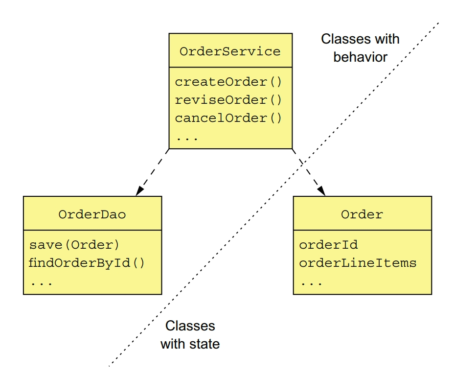
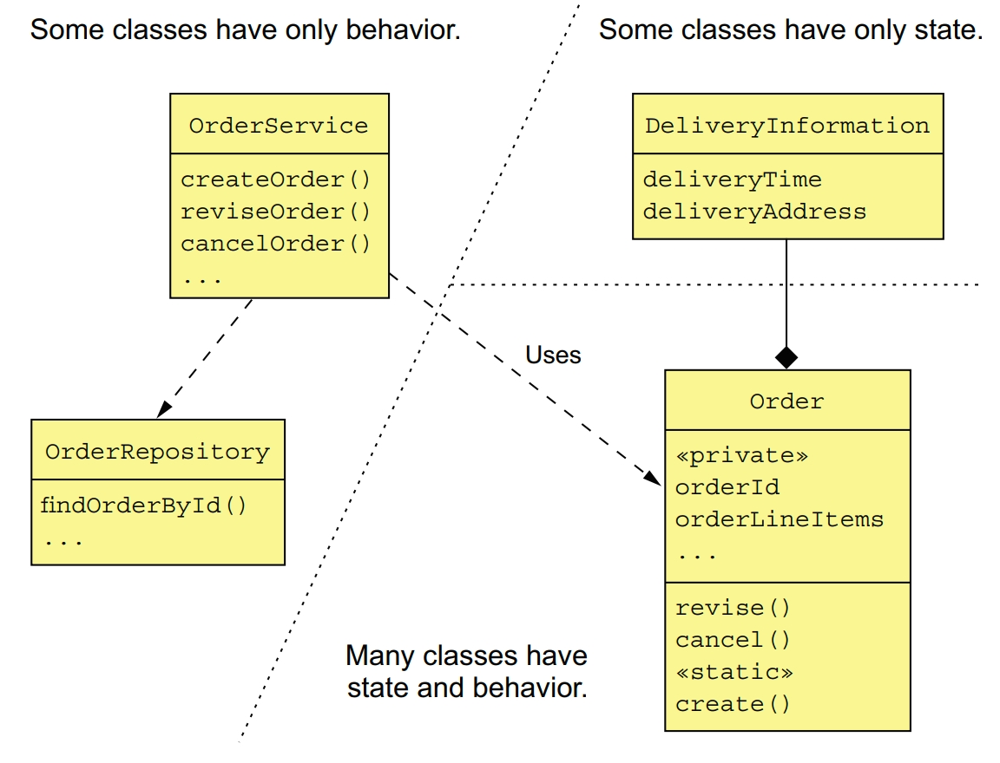
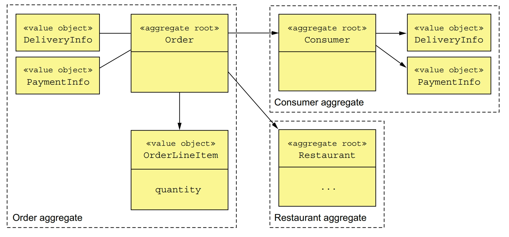

Developing complex business logic is always challenging. Developing complex business logic is even more challenging in a microservice architecture where the business logic is spread over multiple services.

# Transaction Script Pattern
Organize the business logic as a collection of procedural transaction scripts, one for each type of request.

In a typical transaction script-based design, one set of classes implements behavior and another set stores state. The transaction scripts are organized into classes that typically have no state. The scripts use data classes, which typically have no behavior.

This style of design is highly procedural and relies on few of the capabilities of object-oriented programming (OOP) languages.

# Domain Model Pattern
Organize the business logic as an object model consisting of classes that have state and behavior.

In an object-oriented design, the business logic consists of an object model, a network of relatively small classes. These classes typically correspond directly to concepts from the problem domain. In such a design some classes have only either state or behavior, but many contain both, which is the hallmark of a well-designed class.

The domain model pattern works well, but there are a number of problems with this approach, especially in a microservice architecture.

# Domain-Driven Design
DDD is a refinement of OOD and is an approach for developing complex business logic. 

A traditional domain model is a web of interconnected classes. It doesn't explictly specify the boundaries of business objects, such as **Consumer** and **Order**.

# DDD Aggregates
Organize a domain model as a collection of aggregates, each of which is a graph of objects that can be treated as a unit.

An aggregate is a cluster of domain objects within a boundary that can be treated as a unit. It consists of a root entity and possibly one or more other entities and value objects.

Aggregates decompose a domain model into chunks, which are individually easier to understand. They also clarify the scope of operations such as load, update and delete. These operations act on the entire aggregate rather than on parts of it. An aggregate is often loaded in its entirety from the database, thereby avoiding any complications of lazy loading. Deleting an aggregate removes all of its objects from a database.

In DDD, a key part of designing a domain model is identifying aggregates, their boundaries, and their roots. The details of the aggregates' internal structure is secondary.

## aggregate rules
Rule #1: reference only the aggregate root

It requires that the root entity be the only part of an aggregate that can be referenced by classes outside of the aggregate. A client can only update an aggregate by invoking a method on the aggregate root

Rule #2: inter-aggregate references must use primary keys

Another rule is that aggregates reference each other by identity instead of object references. The use of identity rather than object references means that the aggregates are loosely coupled. It ensures that the aggregate boundaries between aggregates are well defined and avoids accidentally updating a different aggregate. Also, if an aggregate is part of another service, there isn't a problem of object references that span services.

Rule #3: one transaction creates or updates one aggregate

Another rule that aggregates must obey is that a transaction can only create or update a single aggregate. This constraint is perfect for the microservice architecture. It ensures that a transaction is contained within a service. This constraint also matches the limited transaction model of most NoSQL databases. This rule makes it more complicated to implement operations that need to create or update multiple aggregates. But this is exactly the problem that sagas are designed to solve. Each step of the saga creates or updates exactly one aggregate.

