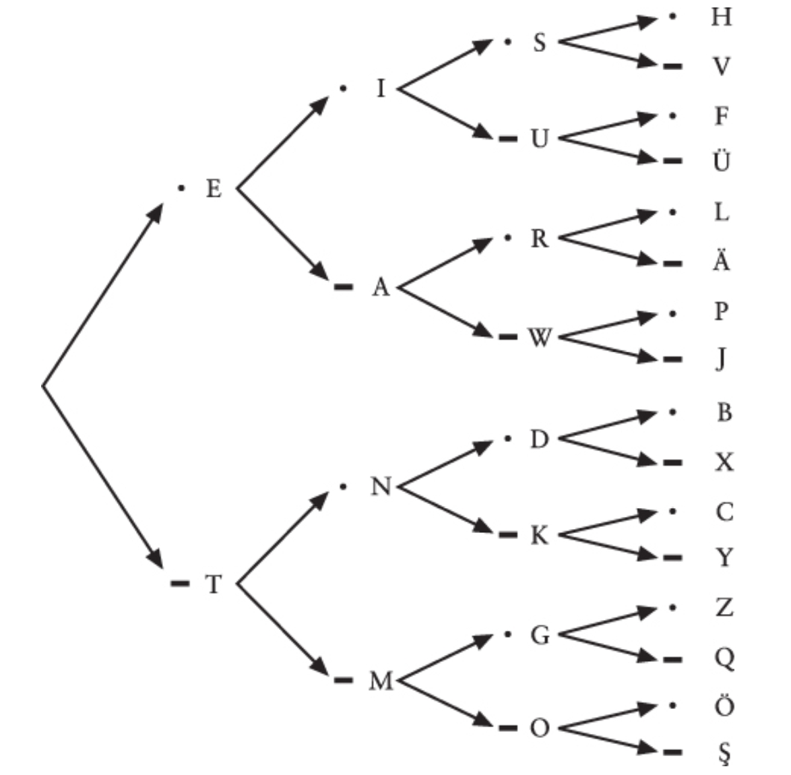

The word *code* usually means a system for transferring information among people, between people and computers, or within computers themselves.

# Morse Code
In Morse code, every letter of the alphabet corresponds to a short series of dots and dashes. Almost everyone knows a little Morse code. Three dots, three dashes, and three dots represent SOS, the international distress signal. SOS isn't an abbreviation for anything, it is simply an easy-to-remember Morse code sequence.

If you think about it, constructing such a table was probably necessary for defining Morse code in the first place. First, it ensures that you don't make the silly mistake of using the same code for two different letters. Second, you're assured of using all the possible codes without making the sequences of dots and dashes unnecessarily long.

Morse code is said to be *binary* because the components of the code consist of only two things, a dot and a dash.