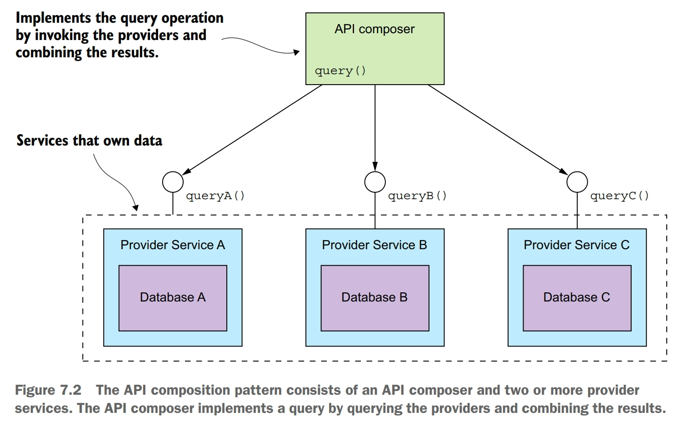
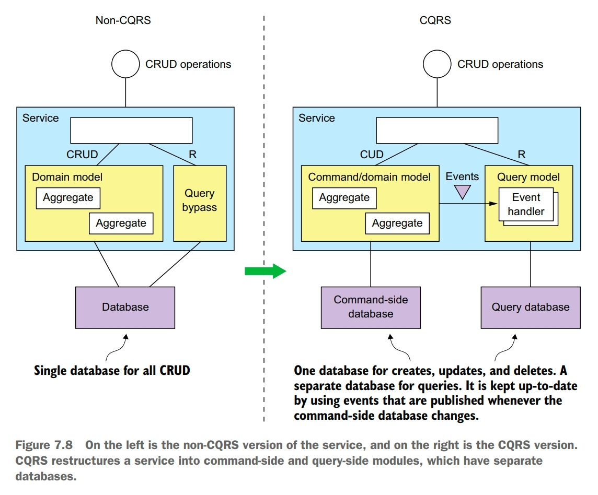
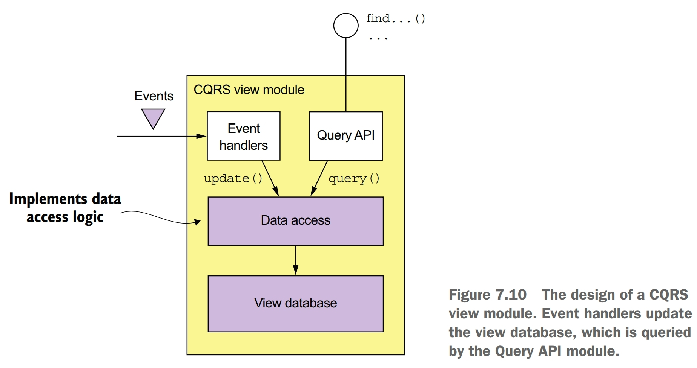
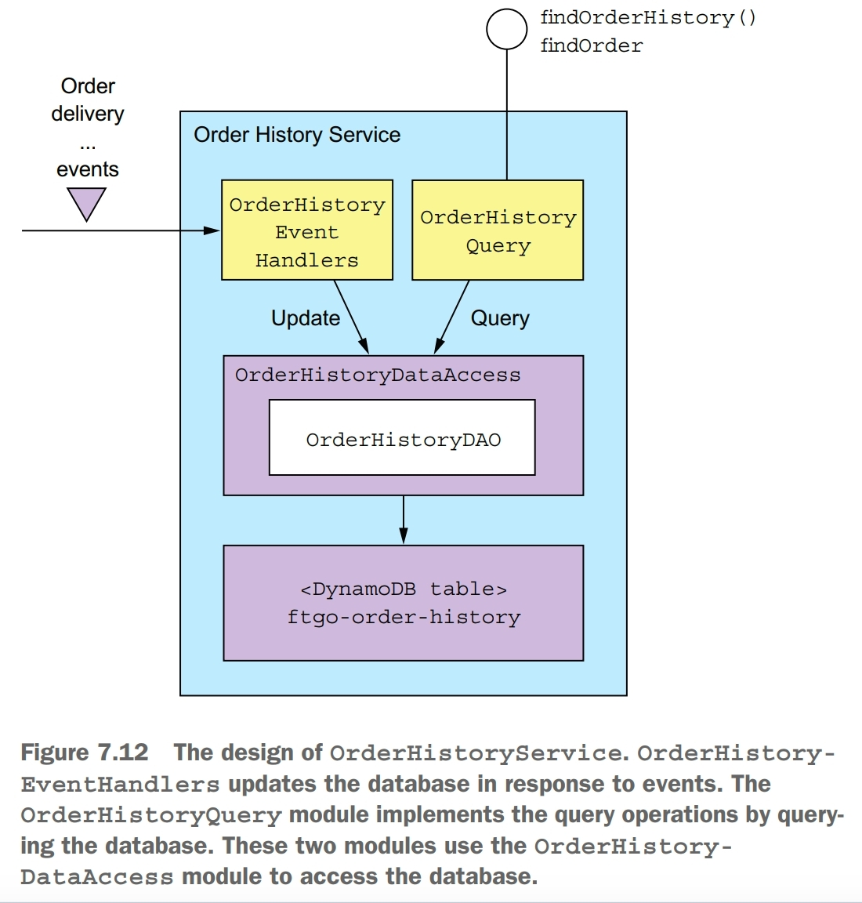

Writing queries in a microservice architecture is challenging. Queries often need to retrieve data that's scattered among the databases owned by multiple services.

There are two different patterns for implementing query operations in a microservice architecture:
- the API composition pattern: this is the simplest approach and should be used whenever possible. It works by making clients of the services that own the data responsible for invoking the services and combining the results.
- the Command Query Responsibility Segregation (CQRS) pattern: this is more powerful than the API composition pattern, but it's also more complex. It maintains one or more view databases whose sole purpose is to support queries.

# API Composition Pattern
Implement a query that retrieves data from several services by querying each service via its API and combining the results.

Whether you can use this pattern to implement a particular query operation depends on several factors, including how the data is partitioned, the capabilities of the APIs exposed by the services that own the data, and the capabilities of the databases used by the services.

who plays the role of the API composer?
- one option is for a client of the services to be the API composer. This option is probably not pratical for clients that are outside of the firewall and access services via a slower network.
- the second option is for an API gateway, which implements the application's external API, to play the role of an API composer for a query operation. This approach enables a client, such as a mobile device, that's running outside of the firewall to efficiently retrieve data from numerous services with a single API call.
- the third option is to implement an API composer as a standalone service. You should use this option for a query operation that's used internally by multiple services. This operation can also be used for externally accessible query operations whose aggregation logic is too complex to be part of an API gateway.

The drawbacks of the API composition pattern:
- increased overhead
- risk of reduced availability
- lack of transactional data consistency

# Why Need CQRS?
The API composition pattern is a good way to implement many queries that must retrieve data from multiple services. Unfortunately, it's only a partial solution to the problem of querying in a microservice architecture. That's because there are multiple service queries the API composition pattern can't implement efficiently. For example, a **findOrderHistory()** query. It's because not all services store the attributes that are used for filtering or sorting. Queries such as **findOrderHistory()** require the API composer to duplicate the functionality of an RDBMS's query execution engine.

What's more, there are also single service queries that are challenging to implement. Perhaps the service's database doesn't efficiently support the query. For example, a **findAvailableRestaurants()** query. Alternatively, it sometimes makes sense for a service to implement a query that retrieves data owned by a different service. For example, it makes sense for **Restaurant Service** to merely provide the restaurant data to another service that implements the **findAvailableRestaurants()** query operation and is most likely owned by the **Order Service** team.

In summary, there are three problems that are commonly encountered when implementing queries in a microservice architecture:
- using the API composition pattern to retrieve data scattered across multiple services results in expensive, inefficient in-memory joins
- the service that owns the data stores the data in a form or in a database that doesn't efficiently support the required query
- the need to separate concerns means that the service that owns the data isn't the service that should implement the query operation

The solution to all three of these problems is to use the CQRS pattern.

# CQRS Pattern
Implement a query that needs data from several services by using events to maintain a read-only view that replicates data from the services.

CQRS pattern has two parts: the command side and the query side. The command side modules and data model implement create, update, and delete operations. The query side modules and data model implement queries. The query side keeps its data model synchronized with the command side data model by subscribing to the events published by the command side.

CQRS can also be applied to implement query service. A query service has an API consisting of only query operations. It implements the query operations by querying a database that it keeps up-to-date by subscribing to events published by one or more other services. For example, **Order History Service**. A query service is also a good way to implement a view that replicates data owned by a single service yet because of the need to separate concerns isn't part of that service. For example, **Avaiable Restaurants Service**.

The benefits of CQRS:
- enables the efficient implementation of queries in a microservice architecture
- enables the efficient implementation of diverse queries
- makes querying possible in an event sourcing-based application
- improves separation of concerns

The drawbacks of CQRS:
- more complex architecture
- dealing with the replication lag

## design CQRS views

You must make some important design decisions when developing a CQRS view:
- you must choose a database and design the schema
- when designing the data access module, you must address various issues, including ensuring that updates are idempotent and handling concurrent updates
- when implementing a new view in an existing application or changing the schema of an existing application, you must implement a mechanism to efficiently build or rebuild the view
- you must decide how to enable a client of the view to cope with the replication lag

### choosing a view datastore
A key design decision is the choice of database and the design of the schema. The primary purpose of the database and the data model is to efficiently implement the view module's query operations. It's the characteristics of those queries that are the primary consideration when selecting a database. But the database must also efficiently implement the update operations performed by the event handlers.

A NoSQL database typically has a limited form of transaction and less general querying capabilities. For certain use cases, these databases have certain advantages over SQL databases, including a more flexible data model and better performance and scalability.

A NoSQL database is often a good choice for a CQRS view, which can leverage its strengths and ignore its weaknesses. A CQRS view benefits from the richer data model, and performance of a NoSQL database. It's unaffected by the limitations of a NoSQL database, because it only uses simple transactions and executes a fixed set of queries.

Having said that, sometimes it makes sense to implement a CQRS view using a SQL database. A modern RDBMS running on modern hardware has excellent performance. Developers, database administrators, and IT operations are, in general, much more familiar with SQL databases than they are with NoSQL databases. In addition, SQL databases often have extensions for non-relational features, such as geospatial datatypes and queries. Also, a CQRS view might need to use a SQL database in order to support for a reporting engine.

### data access module design
The event handlers and the query API module don't access the datastore directly. Instead they use the data access module, which consists of a data access object (DAO) and its helper classes. The DAO has several responsibilities. It implements the update operations invoked by the event handlers and the query operations invoked by the query module. The DAO maps between the data types used by the higher-level code and the database API. It also must handle concurrent updates and ensure that updates are idempotent.

Sometimes a DAO must handle the possibility of multiple concurrent updates to the same database record. A DAO must be written in a way that ensures that this situation is handled correctly. It must not allow one update to overwrite another. If a DAO implements updates by reading a record and then writing the updated record, it must use either pessimistic or optimistic locking.

An event handler is idempotent if handling duplicate events results in the correct outcome. An event handler isn't idempotent if duplicate events result in an incorrect outcome. A non-idempotent event handler must detect and discard duplicate events by recording the IDs of events that it has processed in the view datastore. In order to be reliable, the event handler must record the event ID and update the database atomically.

### adding and updating CQRS views
Adding and updating views is conceptually quite simple but in fact it is not. One problem is that message brokers can't store messages indefinitely. As a result, a view can't be build by only reading all the needed events from the message broker. Instead, an application must also read older events that have been archived. Another problem with view creation is that the time and resources required to process all events keep growing over time. Eventually, view creation will become too slow and expensive. The solution is to use a twp-step incremental algorithm. The first step periodically computes a snapshot of each aggregate instance based on its previous snapshot and events that have occurred since that snapshot was created. The second step creates a view using the snapshots and any subsequent events.

## CQRS example
