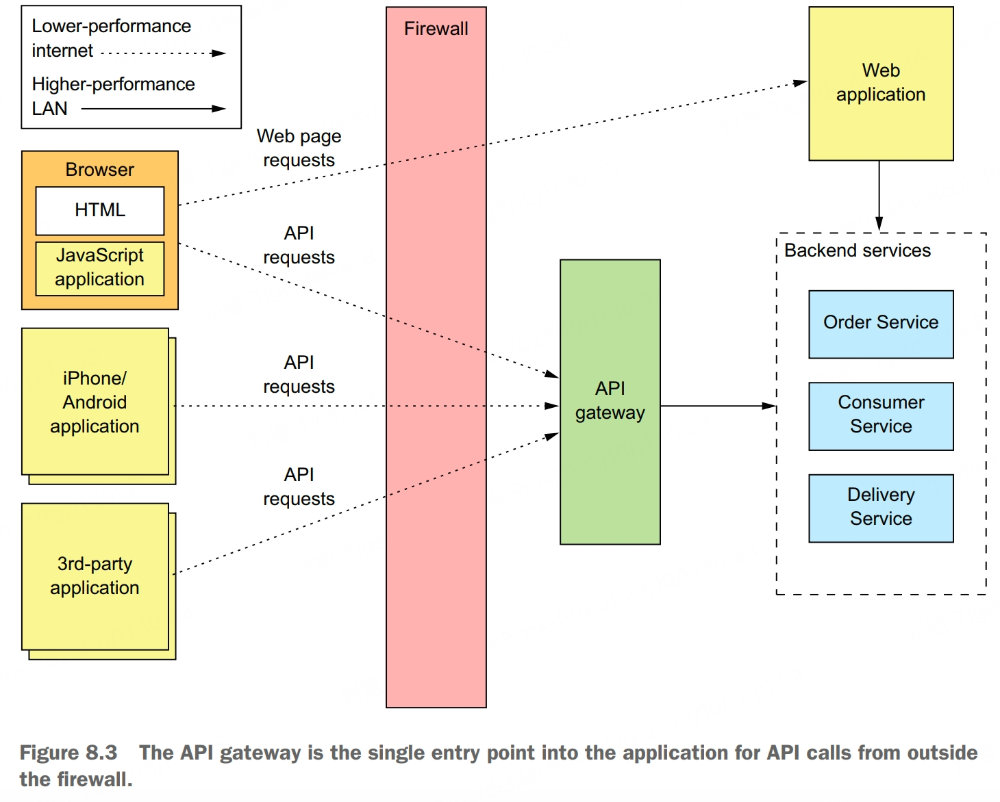
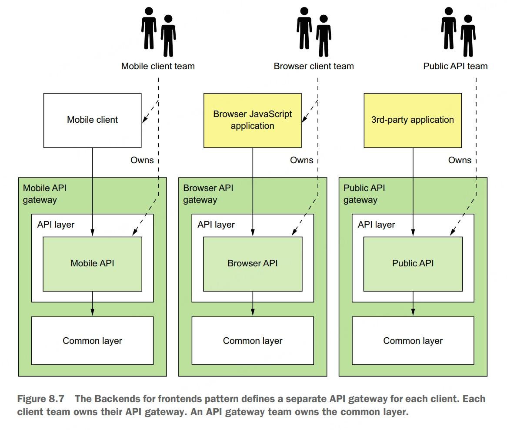

One approach to API design is for clients to invoke the services directly. But this approach is rarely used in a microservice architecture because of the following drawbacks:
- the fine-grained service APIs require clients to make multiple requests to retrieve the data they need, which is inefficient and can result in a poor user experience
- the lack of encapsulation caused by clients knowing about each service and its API makes it difficult to change the architecture and the APIs
- services might use IPC mechanisms that aren't convenient or practical for clients to use, especially those clients outside the firewall

# API Gateway Pattern
Implement a service that's the entry point into the microservice-based applications from external API clients.

An API gateway is a service that's the entry point into the application from the outside world. It's responsible for request routing, API composition, protocol translation, and other functions, such as authentication, monitoring, and rate limiting.

An API gateway could provide a single one-size-fits-all API. The problem with a single API is that different clients often have different requirements. A better approach is for the API gateway to provide each client with its own API.

An important question that you must answer is who is responsible for the development of the API gateway and its operation? A good approach is for the client teams to own the API module that exposes their API. An API gateway team is responsible for developing the common module and for the operational aspects of the gateway.

Backends for Frontends (BFF) Pattern: Implement a separate API gateway for each type of client.

The backends for frontends pattern defines a separate API gateway for each client. Each client team owns their API gateway. An API gateway team owns the common layer.

## performance and scalability
A key design decision that affects performance and scalability is whether the API gateway should use synchronous or asynchronous I/O.

In the synchronous I/O model, each network connection is handled by a dedicated thread. This is a simple programming model and works well. For example, it's the basis of the widely used Java EE servlet framework, although this framework provides the option of completing a request asynchronously. One limitation of synchronous I/O, however, is that operating system threads are heavyweight, so there is a limit on the number of threads, and hence concurrent connections, that an API gateway can have.

The other approach is to use the asynchronous (nonblocking) I/O model. In this model, a single event loop thread dispatches I/O requests to event handlers. Nonblocking I/O is much more scalable because it doesn't have the overhead of using multiple threads. The drawback, though, is that the asynchronous, callback based programming model is much more complex. The code is more difficult to write, understand, and debug. Also, whether using nonblocking I/O has a meaningful overall benefit depends on the characteristics of the API gateway's request-processing logic.

## use reactive programming abstractions
In order to minimize response time, the composition logic should, whenever possible, invoke services concurrently. The challenge is to write concurrent code that's maintainable.

Writing API composition code using the traditional asynchronous callback approach quickly leads you to callback hell. The code will be tangled, difficult to understand, and error prone, especially when composition requires a mixture of parallel and sequential requests. A much better approach is to write API composition code in a declarative style using a reactive approach. Examples of reactive abstractions for the JVM include the following:
- Java 8 **CompleteableFutures**
- Project Reactor **Monos**
- RxJava (Reactive Extensions for Java) **Observables**
- Scala **Futures**

Using one of these reactive abstractions will enable you to write concurrent code that's simple and easy to understand.

## reliability
As well as being scalable, an API gateway must also be reliable. One way to achieve reliability is to run multiple instances of the gateway behind a load balancer. If one instance fails, the load balancer will route requests to the other instances. Another way to ensure that an API gateway is reliable is to properly handle failed requests and requests that have unacceptable high latency.

## developing your own API gateway
A good starting point for developing an API gateway is to use a framework designed for that purpose. Its built-in functionality significantly reduces the amount of code you need to write.

Spring Cloud Gateway is an API gateway framework built on top of several frameworks, including Spring Framework 5, Spring Boot 2, and Spring WebFlux, which is a reactive web framework that's part of Spring Framework 5 and built on Project Reactor. Project Reactor is an NIO-based reactive framework for the JVM that provides the Mono abstraction.