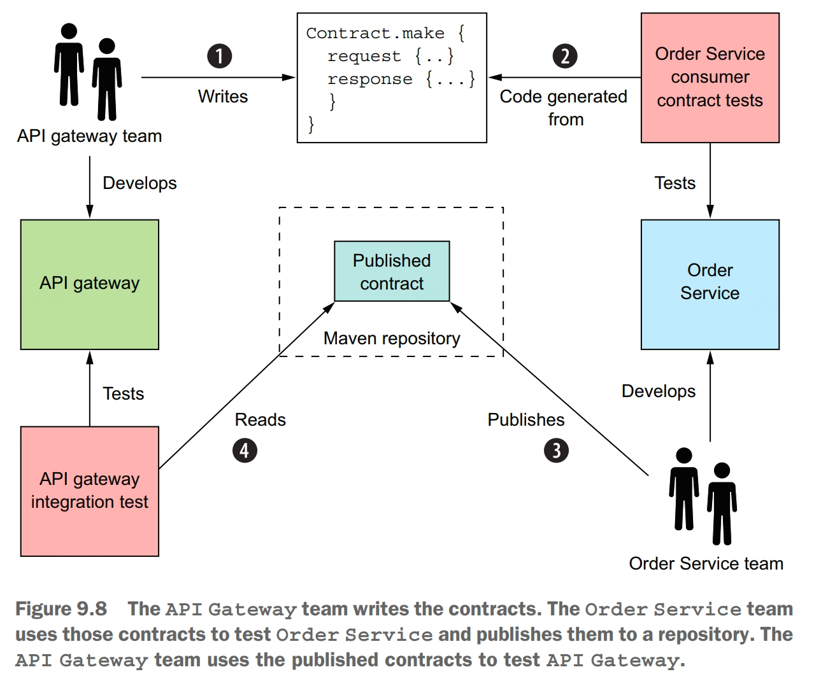

The goal of a test is to verify the behavior of the System Under Test (SUT). An SUT might be as small as a class or as large as an entire application.

# Automated Test
Automated tests are usually written using a testing framework. JUnit, for example, is a populer Java testing framework. Each automated test is implemented by a test method, which belongs to a test class. A *test suite* is a set of test classes, the tests are executed by a *test runner*.

An automated test consists of four phases:
- setup, which initializes the test fixture, which is everything required to run the test
- execute, which invokes the SUT
- verify, which verifies the outcome of the test
- teardown, which cleans up the test fixture

An SUT often has dependencies. The trouble with dependencies is that they can complicate and slow down tests. The solution is to replace the SUT's dependencies with test doubles. A *test double* is an object that simulates the behavior of the dependency. There are two types of test doubles: stubs and mocks. A *stub* is a test double that returns values to the SUT. A *mock* is a test double that a test uses to verify that the SUT correctly invokes a dependency. Mockito is a popular mock object framework for Java.

# Test Pyramid
- unit tests: test a small part of a service, such as a class
- integration tests: verify that a service can interact with infrastructure services suas as databases and other application services
- component tests: acceptance tests for an individual service
- end-to-end tests: acceptance tests for the entire application

At the base of the pyramid are the fast, simple, and reliable unit tests. At the top of the pyramid are the slow, complex, and brittle end-to-end tests. The key idea of the test pyramid is that as we move up the pyramid we should write fewer and fewer tests. We should write lots of unit tests and very few end-to-end tests.

# The Challenge of Testing Microservices
Each interaction between a pair of services represents an agreement or contract between the two services. One way to verify that two services can interact is to run both services, invoke an API that triggers the communication, and verify that it has the expected outcome. It is best to avoid writing end-to-end tests like these. Somehow, we need to write faster, simpler, and more reliable tests that ideally test services in isolation. 

What is *consumer-driven contract testing*? The team that develops the consumer writes a contract test suite and adds it (for example, via a pull request) to the provider's test suite. The developers of other services that invoke **Order Service** also contribute a test suite. Each test suite will test those aspects of **Order Service**'s API that are relevant to each consumer. These test suites are executed by the deployment pipeline for **Order Service**. If a consumer contract test fails, that failure tells the producer team that they've made a breaking change to the API. They must either fix the API or talk to the consumer team. Consumer-driven contract tests typically use testing by example. The interaction between a consumer and provider is defined by a set of examples, known as contracts. Each *contract* consists of example messages that are exchanged during one interaction.

Spring Cloud Contract is a consumer contract testing framework for Spring applications. It provides a Groovy domain-specific language (DSL) for writing contracts. Each contract is a concrete example of an interaction between a consumer and a provider, such as an HTTP request and response. Spring Cloud Contract code generates contract tests for the provider. It also configures mocks, such as a mock HTTP server, for consumer integration tests. 

Spring Cloud Contract also provides support for testing messaging-based interactions. The structure of a contract and how it's used by the tests depend on the type of interaction. A contract for domain event publishing consists of an example domain event. A provider test causes the provider to emit an event and verifies that it matches the contract's event. A consumer test verifies that the consumer can handle that event. A contract for an asynchronous request/response interaction is similar to an HTTP request. It consists of a request message and a response message. A provider test invokes the API with the contract's request message and verifies that the response matches the contract's response. A consumer test uses the contract to configure a stub subscriber, which listens for the contract's request message and replies with the specified response.

# Unit Test
A unit test verifies that a *unit*, which is a very small part of a service, works correctly. A unit is typically a class, so the goal of unit testing is to verify that it behaves as expected.

There are two types of unit tests:
- solitary unit test: tests a class in isolation using mock objects for the class's dependencies
- sociable unit test: tests a class and its dependencies

The responsibilities of the class and its role in the architecture determine which type of test to use. Controller and service classes are often tested using solitary unit tests. Domain objects, such as entities and value objects, are typically tested using sociable unit tests.

# Integration Test
Integration tests verify that a service can communicate with its dependencies, which includes infrastructure services, such as the database, and application services.

# Component Test
Component testing verifies the behavior of a service in isolation. It replaces a service's dependencies with stubs that simulate their behavior. It might even use in-memory versions of infrastructure services such as databases. As a result, component tests are much easier to write and faster to run.
