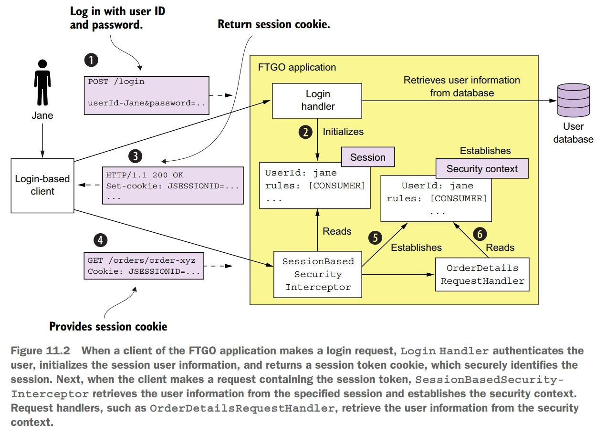
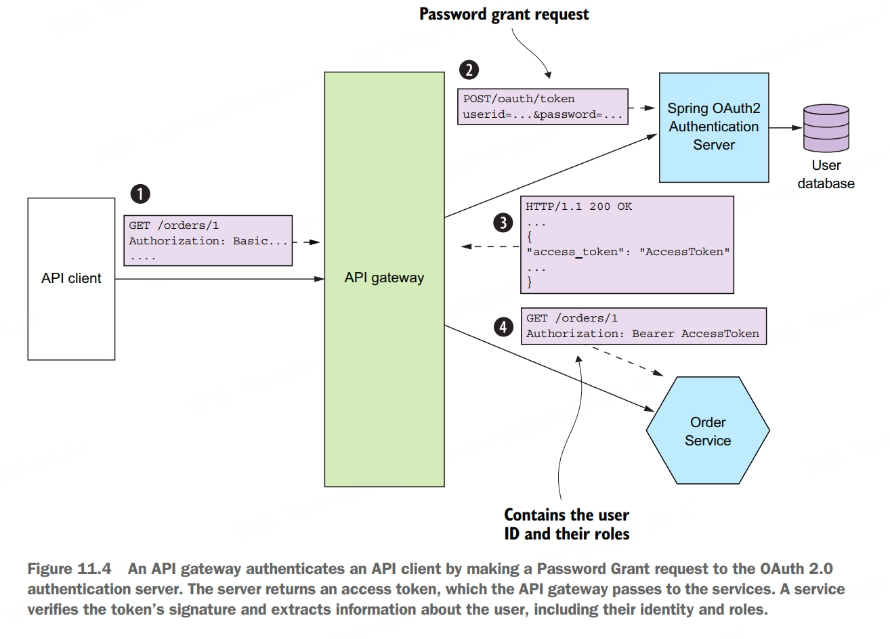

# Authentication and Authorization
Authentication verifies the identity of the principle that's attempting to access the application. For example, an application typically verifies a principle's credentials, such as a user ID and password or an application's API key and secret.

Authorization verifies that the principle is allowed to perform the requested operation on the specified data. Applications often use a combination of role-based security and access control lists (ACLs). Role-based security assigns each user one or more roles that grant them permission to invokve particular operations. ACLs grant users or roles permission to perform an operation on a particular business object, or aggregate.

When a user logs in with their user ID and password, the client makes a POST request containing the user's credentials to the application. The application verifies the credentials and returns a session token to the client. The client includes the session token in each subsequent request to the application. 

A session is identified by a session token, which the client includes in each request. It's usually an opaque token such as a cryptographiclly strong random number. You can sometimes elimate the server-side session entirely. For example, many applications have API clients that provide their credentials, such as an API key and secret, in every request. As a result, there's no need to maintain a server-side session.

In order to implement security in a microservice architecture we need to determine who is responsible for authenticating the user and who is responsible for authorization. A better approach is for the API gateway to authenticate a request before forwarding it to the services. Centralizing API authentication in the API gateway has the advantage that there's only one place to get right. As a result, there's a much smaller chance of a security vulnerability. Another benefit is that only the API gateway has to deal with the various different authentication mechanisms. It hides this complexity from the services.

Clients authenticate with the API gateway. API clients include credentials in each request. Login-based clients **POST** the user's credentials to the API gateway's authentication and receive a session token. Once the API gateway has authenticated a request, it invokes one or more services. A service invoked by the API gateway needs to know the principal making the request. It must also verify that the request has been authenticated. The solution is for the API gateway to include a token in each service request. The service uses the token to validate the request and obtain information about the principle. The API gateway might also give the same token to session-oriented clients to use as the session token.

Authenticating a client's credentials is important but insufficient. An application must also implement an authorization mechanism that verifies that the client is allowed to perform the requested operation. One drawback of implementing authorization in the API gateway is that it risks coupling the API gateway to the services, requiring them to be updated in lockstep. What's more, the API gateway can typically only implement role-based access to URL paths. It's generally not practical for the API gateway to implement ACLs that control access to individual domain objects, because that requires detailed knowledge of a service's domain logic. The other place to implement authorization is in the services. A service can implement role-based authorization for URLs and for service methods. It can also implement ACLs to manage access to aggregates.

When implementing security in a microservice architecture, you need to decide which type of token an API gateway should use to pass user information to the services. There are two types of tokens to choose from. One option is to use opaque tokens, which are typically UUIDs. The downside of opaque tokens is that they reduce performance and availability and increase latency. That's because the recipient of such a token must make a synchronous RPC call to a security service to validate the token and retrieve the user information. An alternative approach, which eliminates the call to the security service, is to use a transparent token containing information about the user. One such popular standard for transparent tokens is the JSON Web Token (JWT). JWT is standard way to securely represent claims, such as user identity and roles, between two parties. A JWT has a payload, which is a JSON object that  contains information about the user, such as their identity and roles, and other metadata, such as an expiration date. It's signed with a secret that's only known to the creator of the JWT, such as the API gateway and the recipient of the JWT, such as a service. The secret ensures that a malicious third party can't forge or tamper with a JWT.

OAuth 2.0 is an authorization protocol that was originally designed to enable a user of a public cloud service, such as GitHub or Google, to grant a third-party application access to its information without revealing its password. An important benefit of using OAuth 2.0 is that it's a proven security standard.

# Configurable Services
Supply configuration property values, such as database credentials and network location, to a service at runtime.

An externalized configuration mechanism provides the configuration property values to a service instance at runtime. There are two main approaches:
- push model, the deployment infrastructure passes the configuration properties to the service instance using, for example, operating system environment variables or a configuration file
- pull model, the service instance reads its configuration properties from a configuration server
  
The push model is an effective and widely used mechanism for configuring a service. One limitation, however, is that reconfiguring a running service might be challenging, if not impossible. The deployment infrastructure might not allow you to change the externalized configuration of a running service without restarting it. Another limitation is that there's risk of the configuration property values being scattered throughout the definition of numerous services. As a result, you may want to consider using a pull model.

# Observable Services
There are several patterns that you should implement to make your service easier to manage and troubleshoot. These patterns expose a service intance's behavior and health. They enable a monitoring system to track and visualize the state of a service and generate alerts when there's a problem.

## health check API pattern
A service exposes a health check API endpoint, such as **GET /health**, which returns the health of the service. The deployment infrastructure periodically invokes this endpoint to determine the health of the service instance and takes the appropriate action if it's unhealthy.

A great example of a health check library is Spring Boot Actuator. It implements a **/actuator/health** endpoint. The code that implements this endpoint returns the result of executing a set of health checks. By using convention over configuration, Spring Boot Actuator implements a sensible set of health checks based on the infrastructure services used by the service. If, for example, a service uses a JDBC **DataSource**, Spring Boot Actuator configures a health check that executes a test query. Similarly, if the service uses the RabbitMQ message broker, it automatically configures a health check that verifies that the RabbitMQ server is up. You can also customize this behavior by implementing additional health checks for your service. You implement a custom health check by defining a class that implements the **HealthIndicator** interface. This interface defines a **health()** method, which is called by the implementation of the **/actuator/health** endpoint. It returns the outcome of the health check.

## log aggregation pattern
Aggregate the logs of all services in a centralized database that supports searching and alerting.

Most programming languages have one or more logging libraries that make it easy to generate correctly structured log entries. For example, three popular Java logging libraries are Logback, log4j, and JUL. There's also SLF4J, which is a logging facade API for the various logging frameworks.

You also need to decide where to log. Traditionally, you would configure the loging framework to write to a log file in a well-known location in the filesystem. But with the more modern deployment technologies, such as containers and serverless, this is often not the best approach. Instead, your service should log to **stdout**. The deployment infrastructure will then decide what to do with the output of your sercive.

The logging infrastructure is responsible for aggregating the logs, storing them, and enabling the user to search them. One popular logging infrastructure is the ELK stack. ELK consists of three open source products:
- Elasticsearch, a text search-oriented NoSQL database that's used as the logging server
- Logstash, a log pipeline that aggreates the service logs and writes them to Elasticsearch
- Kibana, a visualization tool for Elasticsearch

## distributed tracing pattern
Assign each external request a unique ID and record how it flows through the system from one service to the next in a centralized server that provides visualization and analysis.

A trace represents an external request and consists of one or more spans. A span represents an operation, and its key attributes are an operation name, start timestamp, and end time. A span can have one or more child spans, which represent nested operations. For example, a top-level span might represent the invocation of the API gateway. Its child spans represent the invocations of services by the API gateway.

A valuable side effect of distributed tracing is that it assigns a unique ID to each external request. A service can include the request ID in its log entries. When combined with log aggregation, the request ID enables you to easily find all log entries for a particular external request.

There are two parts to distributed tracing: an instrumentation library, which is used by each service, and a distributed tracing server. The instrumentation library manages the traces and spans. It also adds tracing information, such as the current trace ID and the parent trace ID, to outbound requests. The instrumentation library also reports traces to the distributed tracing server. The distributed tracing server stores the traces and provides a UI for visualizing them. One popular instrumentation library is Spring Cloud Sleuth and one popular distributed tracing server is Open Zipkin.

## application metrics pattern
Services report metrics to a central server that provides aggregation, visualization, and alerting.

A key part of the production environment is monitoring and altering. The monitoring system gathers metrics, which provide critical information about the health of an application, from every part of the technology stack. Metrics range from infrastructure-level metrics, such as CPU, memory, and disk utilization, to application-level metrics, such as service request latency and number of requests executed.

Many aspects of monitoring are the responsiblity of operations. But a service developer is responsible for two aspects of metrics. First, they must instrument their service so that it collects metrics about its behavior. Second, they must expose those service metrics, along with metrics from the JVM and the application framework, to the metrics server.

A service delivers metrics to the metrics service in one of two ways: push or pull. With the push model, a service instance sends the metrics to the metrics service by invoking an API. With the pull model, the metrics service (or its agent running locally) invokes a service API to retrieve the metrics from the service instance. Prometheus, a popular open source monitoring and alerting system, uses the pull model. The Prometheus server periodically polls to retrieve metrics. Once the metrics are in Prometheus, you can view them using Grafana, a data visualization tool.

## exception tracking pattern
Services report exceptions to a central exception tracking service that de-duplicates exceptions, generates alerts, and manages the resolution of exceptions.

There are a couple of ways to integrate the exception tracking service into your application. You service could invoke the exception tracking service's API directly. A better approach is to use a client library provided by the exception tracking service.

## audit logging pattern
Record user actions in a database in order to help customer support, ensure compliance, and detect suspicious behavior.

Each audit log entry records the identity of the user, the action they performed, and the business object. An application usually stores the audit log in a database table.