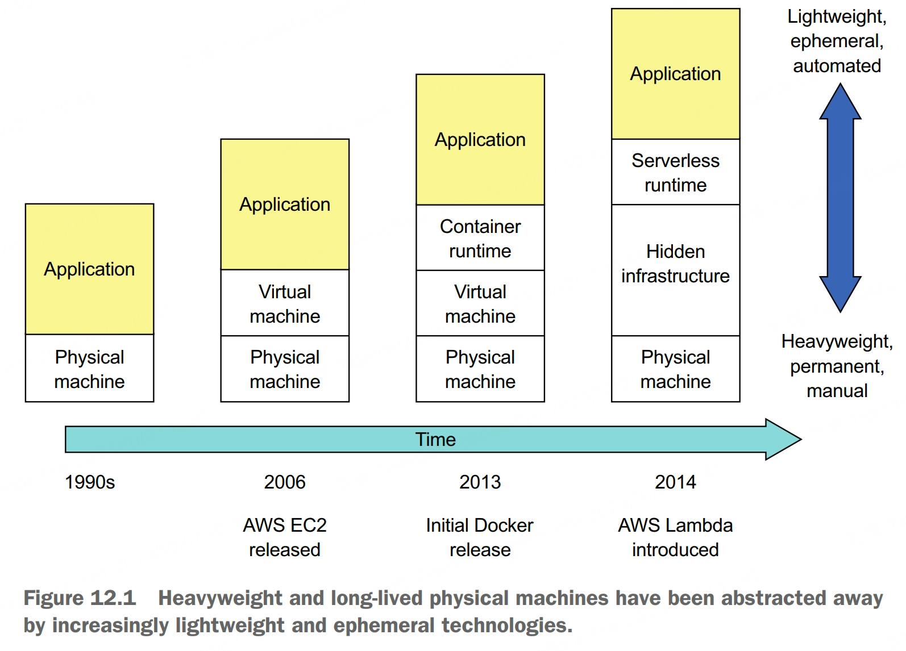
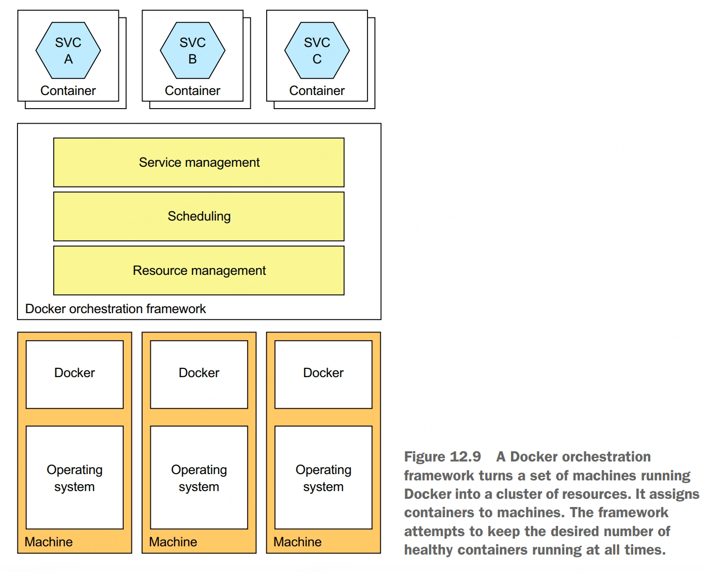

Deployment is a combination of two interrelated concepts: process and architecture. The deployment process consists of the steps that must be performed by people, developers and operations, in order to get software into production. The deploment architecture defines the structure of the environment in which that software runs.

# Deploying Services using the Language-specific Packaging Pattern
Deploy a language-specific package into production.

Benefits:
- fast deployment
- efficient resource utilization

Drawbacks:
- lack of encapsulation of the technology stack
- no ability to constrain the resources consumed by a service instance
- lack of isolation when running multiple service instances on the same machine
- automatically determining where to place service instances is challenging

The service as a language-specific package pattern has some significant drawbacks. You should rarely use this approach, except perhaps when efficiency outweighs all other concerns.

# Deploying Services using the Service as a Virtual Machine Pattern
Deploy services packaged as VM images into production. Each service instance is a VM.

The deployment pipeline packages a service as a virtual machine image containing everything required to run the service, including the language runtime. At runtime, each service instance is a VM, instantiated from that image.

Benefits:
- the VM image encapsulates the technology stack
- isolated service instances
- uses mature cloud infrastructure

Drawbacks:
- less-efficient resource utilization
- relatively slow deployments
- system administration overhead

# Deploying Services using the Service as a Container Pattern
Deploy services packaged as container images into production. Each service instance is a container.

The most popular example of a container runtime is Docker, and Kubernetes is a Docker orchestration framework.

To deploy a service as a container, you must package it as a container image. A container image is a filesystem image consisting of the application and software required to run the service.

The fist step in building an image is to create a Dockerfile. A Dockerfile describes how to build a Docker container image. It specifies the base container image, a series of instructions for installing software and configuring the container, and the shell command to run when the container is created. Once you've written the Dockerfile, you can then build the image. The final step of the build process is to push the newly built Docker image to what is known as a registry.

Once you've packaged your service as a container image, you can then create one or more containers. The container infrastructure will pull the image from the registry onto a production server. It will then create one or more containers from that image. Each container is an instance of your service. A better approach that's especially useful during development is to use Docker Compose. Docker Compose is a tool that lets you declaratively define a set of containers using a YAML file, and then start and stop those containers as a group. The problem with Docker Compose, though, is that it's limited to a single machine. To deploy services reliably, you must use a Docker orchestration framework, such as Kubernetes, which turns a set of machines into a pool of resources.

Benefits:
- encapsulation of the technology stack
- service instances are isolated
- service instances's resources are constrained

Drawbacks:
- system administration overhead

# Deploying Services using Kubernetes
Kubernetes is a Docker orchestration framework, a layer of software on top of Docker that turns a set of machines into a single pool of resources for running services. The agility of containers combined with the sophistication of Kubernetes is a compelling way to deploy services.

Kubernetes runs on a cluster of machines. Each machine in a Kubernetes cluster is either a master or a node. A master machine is responsible for managing the cluster. A node is a worker that runs one or more pods.

A pod is the basic unit of deployment in Kubernetes. It consists of one or more containers that share an IP address and storage volumes. The pod for a service instance often consists of a single container, such as a container running the JVM. But in some scenarios a pod contains one or more *sidecar* containers, which implement supporting functions.

*Deployment* is a declarative specification of a pod. A deployment is a controller that ensures that the desired number of instances of the pod are running at all times. It supports versioning with rolling upgrades and rollbacks.

A *service* is a Kubernetes object that provides the clients of one or more pods with a stable endpoint. It has an IP address and a DNS name that resolves that IP address.