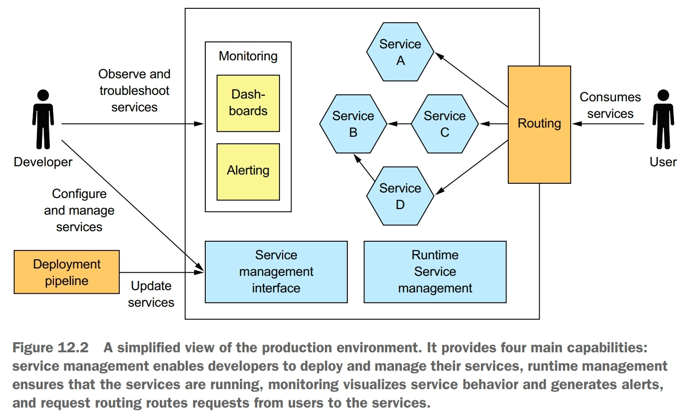
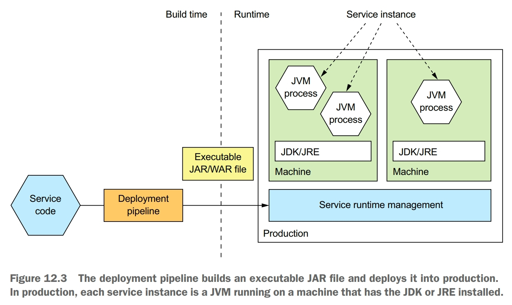
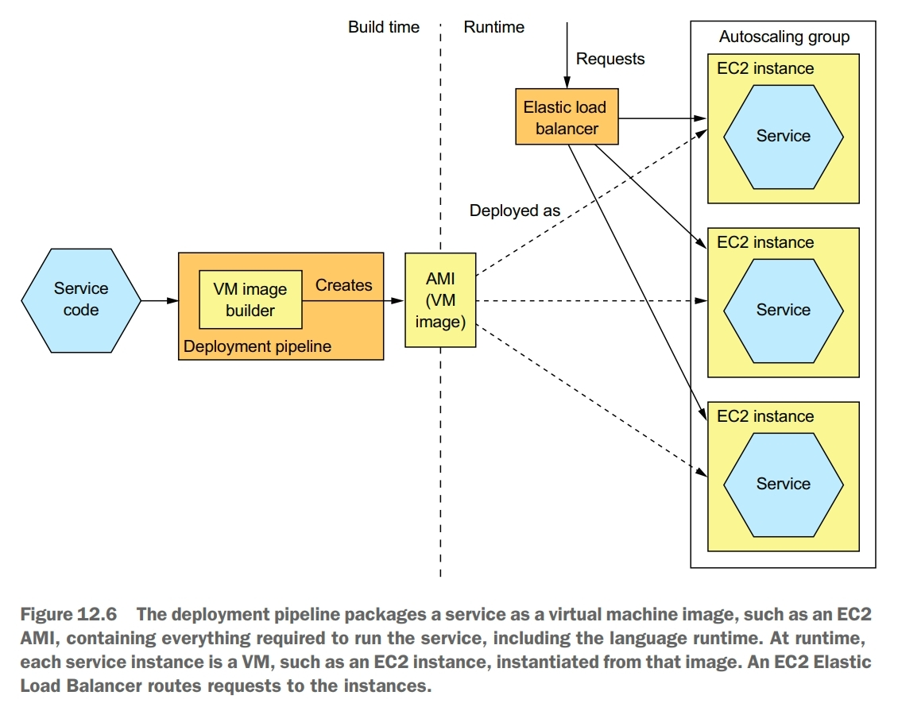
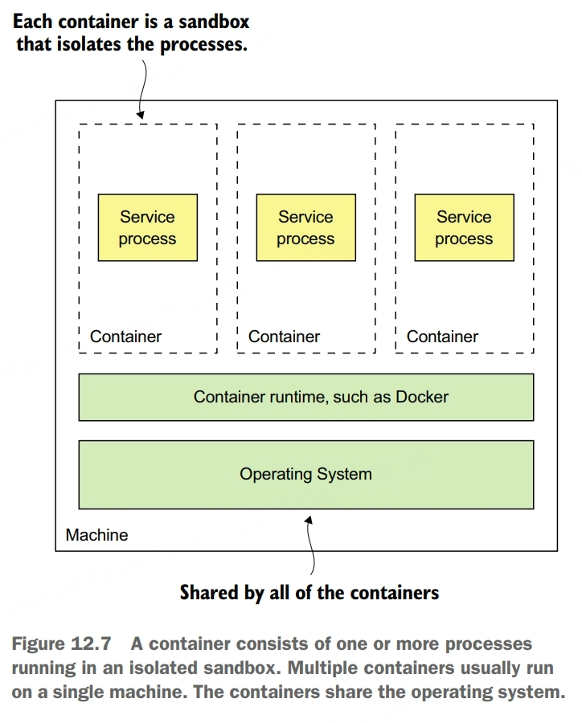
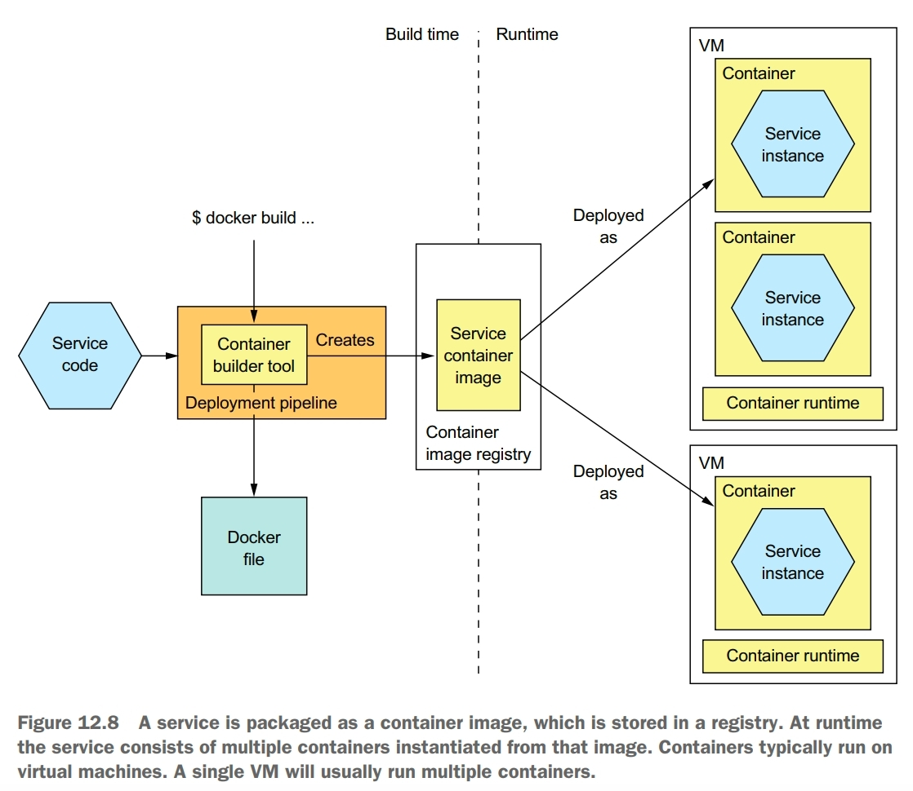

Deployment is a combination of two interrelated concepts: process and architecture. The deployment process consists of the steps that must be performed by people, developers and operations, in order to get software into production. The deploment architecture defines the structure of the environment in which that software runs.

A production environment must implement four key capabilities:
- service management interface, enables developers to create, update, and configure services. Usually, this interface is a REST API invoked by command-line and GUI deployment tools
- runtime service management, apptempts to ensure that the desired number of service instances is running at all times. If a service instance crashes or is somehow unable to handle requests, the production environment must restart it. If a machine crashes, the production environment must restart those service instances on a different machine
- monitoring, provides developers with insight into what their services are doing, including log files and metrics. If there are problems, the production environment must alert the developers.
- request routing, route requests from users to the services

# Deploying Services using the Language-specific Packaging Pattern
Deploy a language-specific package into production.

Benefits:
- fast deployment
- efficient resource utilization, especially when running multiple instances on the same machine or within the same process

Drawbacks:
- lack of encapsulation of the technology stack, the operation team must know the specific details of how to deploy each and every service
- no ability to constrain the resources consumed by a service instance
- lack of isolation when running multiple service instances on the same machine
- automatically determining where to place service instances is challenging

The service as a language-specific package pattern has some significant drawbacks. You should rarely use this approach, except perhaps when efficiency outweighs all other concerns.

# Deploying Services using the Service as a Virtual Machine Pattern
Deploy services packaged as VM images into production. Each service instance is a VM.

The deployment pipeline packages a service as a virtual machine image containing everything required to run the service, including the language runtime. At runtime, each service instance is a VM, instantiated from that image.

Benefits:
- the VM image encapsulates the technology stack, an important benefit of this pattern is that the VM image contains the service and all of its dependencies. It eliminates the error-prone requirement to correctly install and set up the software that a service needs in order to run. Once a service has been packaged as a virtual machine, it becomes a black box that encapsulates your service's technology stack. The VM image can be deployed anywhere without modification
- isolated service instances, a major benefit of virtual machines is that each service instance runs in complete isolation. That, after all, is one of the main goals of virtual machine technology. Each virtual machine has a fixed amount of CPU and memory and can't steal resources from other services
- uses mature cloud infrastructure, another benefit of deploying your microservices as virtual machines is that you can leverage mature, highly automated cloud infrastructure

Drawbacks:
- less-efficient resource utilization
- relatively slow deployments
- system administration overhead

# Deploying Services using the Service as a Container Pattern
Deploy services packaged as container images into production. Each service instance is a container.

From the perspective of a process running in a container, it's as if it's running on its own machine. It typically has its own IP address, which eliminates port conflicts. All Java processes can, for example, listen on port 8080. Each container has its own root filesystem. The container runtime uses operating system mechanisms to isolate the containers from each other. 

The most popular example of a container runtime is Docker, and Kubernetes is a Docker orchestration framework.

When you create a container, you can specify its CPU, memory resources, and depending on the container implementation, perhaps the I/O resources. The container runtime enforeces these limits and prevents from hogging the resources of its machine. When using a Docker orchestration framework such as Kubernetes, it's specially important to specify a container's resources. That's because the orchestration framework uses a container's requested resources to select the machine to run the container and thereby ensure that machines aren't overloaded.

At build-time, the deployment pipeline uses a container image-building tool, which reads the service's code and a description of the image, to create the container image and stores it in a registry. At runtime, the container image is pulled from the registry and used to create containers.

To deploy a service as a container, you must package it as a container image. A container image is a filesystem image consisting of the application and software required to run the service. 

The fist step in building an image is to create a Dockerfile. A Dockerfile describes how to build a Docker container image. It specifies the base container image, a series of instructions for installing software and configuring the container, and the shell command to run when the container is created. 

Once you've written the Dockerfile, you can then build the image. The final step of the build process is to push the newly built Docker image to what is known as a registry. A Docker registry is the equivalent of a Java Maven repository for Java libraries. Docker hub is an example of a public Docker registry and is equivalent to Maven Central. But for your applications you'll probably want to use a private registry.

Once you've packaged your service as a container image, you can then create one or more containers. The container infrastructure will pull the image from the registry onto a production server. It will then create one or more containers from that image. Each container is an instance of your service. 

Unlike virtual machines, containers are a lightweight technology. Container images are typically fast to build. Moving a container image over the network, such as to and from the container registry, is also relatively fast, primarily because only a subset of an image's layers need to be transferred. Containers also start very quickly, because there's no lenghy OS boot process. When a container starts, all that runs is the service.

Benefits:
- encapsulation of the technology stack
- service instances are isolated
- service instances's resources are constrained

Drawbacks:
- system administration overhead

# Deploying Services using Kubernetes
Kubernetes is a Docker orchestration framework, a layer of software on top of Docker that turns a set of machines into a single pool of resources for running services. It endeavors to keep the desired number of instances of each service running at all times, even when service instances or machines crash. The agility of containers combined with the sophistication of Kubernetes is a compelling way to deploy services.

A Docker orchestration framework treats a set of machines running Docker as a pool of resources. A Docker orchestration framework, such as Kubernetes, has three main functions:
- resource management, treats a cluster of machines as a pool of CPU, memory, and storage volumes, turning the collection of machines into a single machine
- scheduling, selects the machine to run your container. By default, scheduling considers the resource requirements of the container and each node's avaiable resources
- service management, implements the concept of named and versioned services that map directly to services in the microservice architecture. The orchestration framework ensures that the desired number of healthy instances is running at all times. It load balances requests across them. The orchestration framework performs rolling upgrades of services and lets you roll back to an old version

Kubernetes runs on a cluster of machines. Each machine in a Kubernetes cluster is either a master or a node. A master machine is responsible for managing the cluster. A node is a worker that runs one or more pods. 

A pod is the basic unit of deployment in Kubernetes. It consists of one or more containers that share an IP address and storage volumes. The pod for a service instance often consists of a single container, such as a container running the JVM. But in some scenarios a pod contains one or more *sidecar* containers, which implement supporting functions.

Kubernetes implements two different checks:
- readinessProbe, used to determine whether it should route traffic to a service instance. If some number (default is 1) of consecutive readinessProbe succeeds, Kubernetes considers the service to be ready, whereas if some number (default 3) of consecutive readinessProbe fail, it's considered not to be ready. Kubernetes will only route traffic to the service instance when the readinessProbe indicates that it's ready
- livenessProbe, used to determine whether Kubernetes should terminate and restart the service instance. If some number (default 3) of consecutive livenessProbe fail in a row, Kubernetes will terminate and restart the service

# Deploying Services using the Serverless Deployment Pattern
The language-specific packaging, service as a VM, and service as a container patterns are all quite different, but they share some common characteristics. The first is that with all three patterns you must preprovision some computing resources, either physical machines, virtual machines, or containers. Another common characteristic is that you're responsible for system administration.

Deploy services using a serverless deployment mechanism provided by a public cloud.

The main public clouds all provide a serverless deployment option, although AWS Lambda is the most advanced. To deploy a service, you package your application as a ZIP file or JAR file, upload it to AWS Lambda, and specify the name of the function to invoke to handle a request. AWS Lambda automatically runs enough instances of your microservice to handle incoming requests. You'll billed for each request based on the time token and the memory consumed.