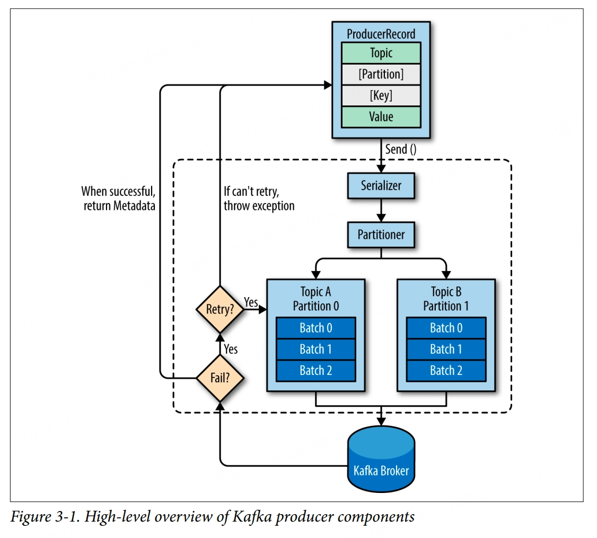

There are many reasons an application might need to write messages to Kafka. The different requirements will influence the way you use the producer API to write messages to Kafka and the configuration you use.

There are three primary methods of sending messages:
- fire-and-forget: we send a message to the server and don't really care if it arrives successfully or not. Most of the time, it will arrive successfully, since Kafka is highly available and the producer will retry sending messages automatically. However, some messages will get lost during using this method
- synchronous send: we send a message, the **send()** method returns a **Future** object, and we use **get()** to wait on the future and see if the **send()** was successful or not
- asynchronous send: we call the **send()** method with a callback function, which gets triggered when it receives a response from the Kafka broker

# Configuration
### acks
The **acks** parameter controls how many partition replicas must receive the record before the producer can consider the write successful. This option has a significant impact on how likely messages are to be lost.
- acks = 0, the producer will not wait for a reply from the broker
- acks = 1, the producer will receive a success response from the broker the moment the leader replica received the message
- acks = all, the producer will receive a success response from the broker once all in-sync replicas received the message

### buffer.memory
This sets the amount of memory the producer will use to buffer messages waiting to be sent to brokers.

### compression.type
By default, messages are sent uncompressed. This parameter can be set to **snappy**, **gzip**, or **lz4**, in which case the corresponding compression algorithms will be used to compress the data before sending it to the brokers.

### retries
When the producer receives an error message from the server, the error could be transient. In which case, the value of the **retries** parameter will control how many times the producer will retry sending the message before giving up and notifying the client of an issue. By default, the producer will wait 100ms between retries, but you can control this using the **retry.backoff.ms** parameter. Not all errors will be retried by the producer. Some errors are not transient and will not cause retries. In general, because the producer handles retries for you, there is no point in handling retries within your own application logic. You will want to focus your efforts on handling nonretriable errors or cases where retry attempts were exhausted.

### batch.size
When multiple records are sent to the same partition, the producer will batch them together. This parameter controls the amount of memory in bytes that will be used for each batch.

### linger.ms
**linger.ms** controls the amount of time to wait for additional messages before sending the current batch. **KafkaProducer** sends a batch of messages either when the current batch is full or when the **linger.ms** limit is reached. By default, the producer will send messages as soon as there is a sender thread available to send them, even if there's just one message in the batch. By setting **linger.ms** higher than 0, we instruct the producer to wait a few milliseconds to add additional messages to the batch before sending it to the brokers. This increases latency but also increases throughput.

### max.in.flight.requests.per.connection
This controls how many messages the producer will send to the server without receiving responses. Setting this to 1 will guarantee that messages will be written to the broker in the order in which they were sent, even when retries occur.

### request.timeout.ms
**request.timeout.ms** controls how long the producer will wait for a reply from the server when sending data.

### timeout.ms
**timeout.ms** controls the time the broker will wait for in-sync replicas to acknowledge the message in order to meet the **acks** configuration. The broker will return an error if the time elapses without the necessary acknowledgments.

# Serializers
It's recommended to use existing serializers and deserializers such as JSON, Apache Avro, or Protobuf rather than writing custom serializers.

# Partitions
The mapping of keys to partitions is consistent only as long as the number of partitions in a topic does not change. However, the moment you add new partitions to the topic, this is no longer guaranteed. When partitioning keys is important, the easiest solution is to create topics with sufficient partitions and never add partitions.
