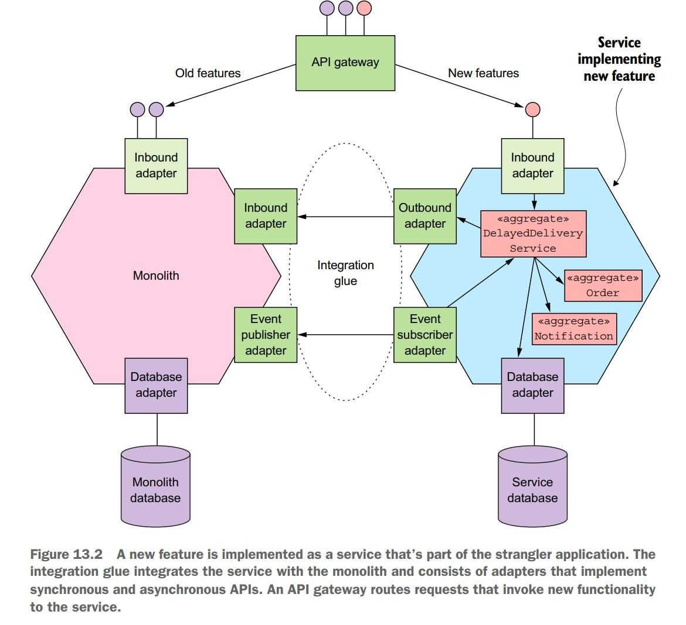
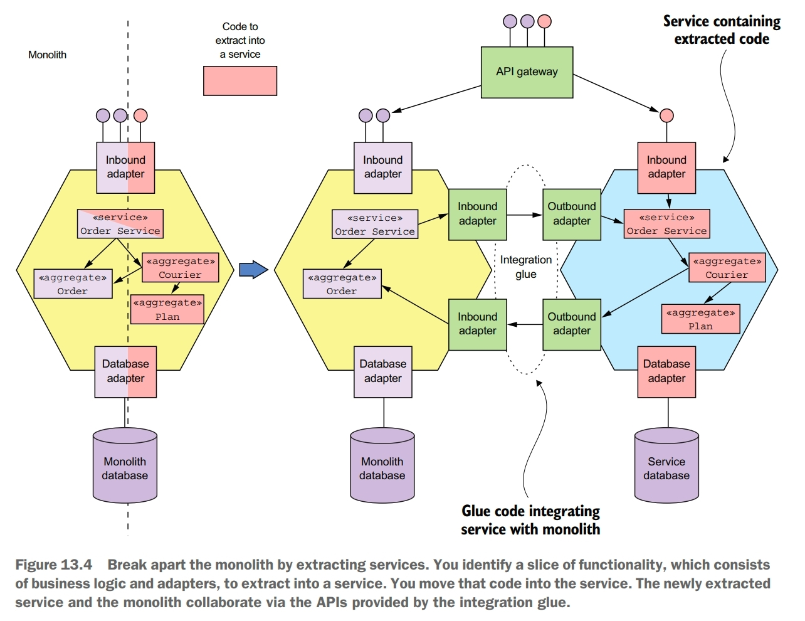
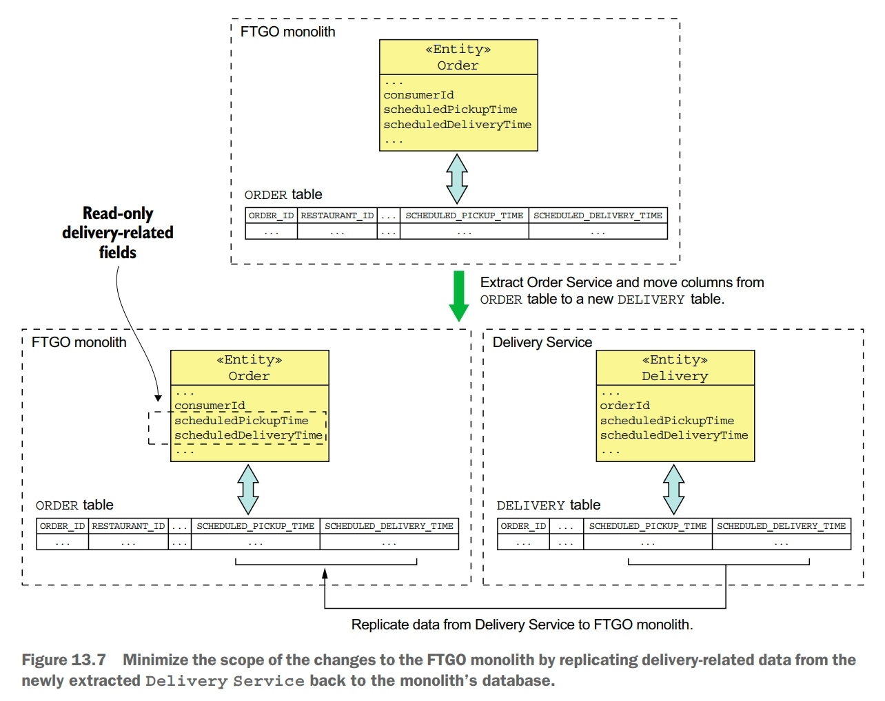
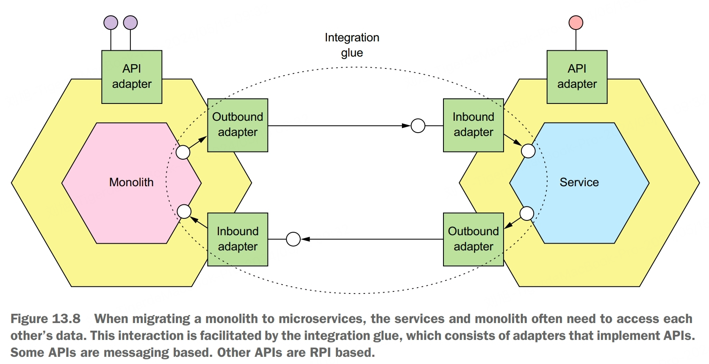

Application modernization is the process of converting a legacy application to one having a modern architecture and technology stack.

A big bang rewrite is when you develop a new application from scratch. Although starting from scratch and leaving the legacy code base behind sounds appealing, it's extremely risky and will likely end in failure.

Instead of doing a big bang rewrite, you should incrementally refactor your monolithic application. You gradually build a new application, which is called a strangler application. A strangler application is a new application consisting of microservices that you develop by implementing new functionality as services and extracting services from the monolith. Over time, as the strangler application implements more and more functionality, it shrinks and ultimately kills the monolith. An important benefit of developing a strangler application is that, unlike a big bang rewrite, it delivers value to the business early and often.

You should avoid making widespread changes to the monolith when migrating to a microservice architecture. The problem with making widespread changes to the monolith is that it's time consuming, costly, and risky. Fortunately, there are strategies you can use for reducing the scope of the changes you need to make.

# Implementing New Features as Services

Integration glue code is used to integrates the service with the monolith. It enables the service to access data owned by the monolith and to invoke functionality implemented by the monolith.

Ideally, you should implement every new feature in the strangler application rather than in the monolith. You'll implement a new feature as either a new service or as part of an existing service. This way you'll avoid ever having to touch the monolith code base. Unfortunately, though, not every new feature can be implemented as a service. A feature might, for instance, be too small to be a meaningful service. Or the new feature might be too tightly coupled to the code in the monolith. If you attempted to implement this kind of feature as a service you would typically find that performance would suffer because of excessive interprocess communication. You might also have problems maintaining data consistency. If a new feature can't be implemented as a service, the solution is often to initially implement the new feature in the monolith. Later on, you can then extract that feature along with other related features into their own service.

# Extract Business Capabilities into Services

Extracting services is challenging. You need to determine how to split the monolith's domain model into two separate domain models, one of which becomes the service's domain model. You need to break dependencies such as object references. You might even need to split classes in order to move functionality into the service. You also need to refactor the database.

In order to extract a service, you need to extract its domain model out of the monolith's domain model. One challenge you'll encounter is eliminating object references that would otherwise span service boundaries. One good way to solve this problem is to think in terms of DDD aggregates. Aggregates reference each other using primary keys rather than object references. One issue with replacing object references with primary keys is that although this is a minor change to the class, it can potentially have a large impact on the clients of the class, which expect an object reference.

Extracting a service is often much more involved than moving entire classes into a service. An even greater challenge with splitting a domain model is extracting functionality that's embedded in a class that has other responsibilities. This problem often occurs in god classes that have an excessive number of responsibilities.

Splitting a domain model involves more than just changing code. Many classes in a domain model are persistent. Their fields are mapped to a database schema. Consequently, when you extract a service from the monolith, you're also moving data. You need to move tables from the monolith's database to the service's database.

Extracting a service requires you to change to the monolith's domain model. For example, you replace object references with primary keys and split classes. These types of changes can ripple through the code base and require you to make widespread changes to the monolith. Making these kinds of changes can be extremely time consuming and can become a huge barrier to breaking up the monolith.

One popular technique is the idea of replicating data in order to allow you to incrementally update clients of the database to use the new schema. We can adapt this idea to reduce the scope of the changes you must make to the monolith when extracting a service.

# Interaction Between Service and Monolith

The interaction between a service and the monolith is facilitated by integration glue code. It consists of adapters in the service and monilith that communicate using some kind of IPC mechanism. Depending on the requirements, the service and monilith might interact over REST or they might use messaging. They might even communicate using multiple IPC mechanisms.

An important design decision you must make when designing the integration glue is selecting the interaction styles and IPC mechanisms that enable the service and the monolith to collaborate.

Because of the service and the monolith may have different domain models, you must implement an anti-corruption layer in order for the service to communicate with the monolith. An anti-corruption layer is a software layer that translates between different domain models in order to prevent concepts from one model polluting another.

When you develop a service, you might find it challenging to maintain data consistency across the service and the monolith. The problem with using sagas is that the monolith might not be a willing participant. If the monolith's transactions are either pivot transactions or retriable transactions, then implementing sagas should be straightforward. The problem with compensating transactions in the monolith is that you might need to make numerous and time-consuming changes to the monolith in order to support them. The monolith might also need to implement countermeasures to handle the lack of isolation between sagas. The cost of these code changes can be a hugh obstacle to extracting a service. Fortunately, you may be able to simplify implementation by carefully ordering the sequence of service extractions so that the monolith's transactions never need to be compensatable.

Another design issue you need to tackle when refactoring a monolithic application to a microservice architecture is adapting the monolith's security mechanism to support the services. A microservice-based application uses tokens, such as JWT, to pass around user identity. That's quite different than a typical traditional, monolithic application that uses in-memory session state and passes around the user identity using a thread local. The challenge when refactoring a monolithic application to a microservice architecture is that you need to support both the monolithic and JWT-based security mechanisms simultaneously. Fortunately, there's a straightforward way to solve this problem that only requires you to make one small change to the monolith's login request handler. The login handler returns an additional cookie that contains user information, such as the user ID and roles. The browser includes that cookie in every request. The API gateway extracts the information from the cookie and includes it in the HTTP requests that it makes to a service. As a result, each service has access to the needed user information.