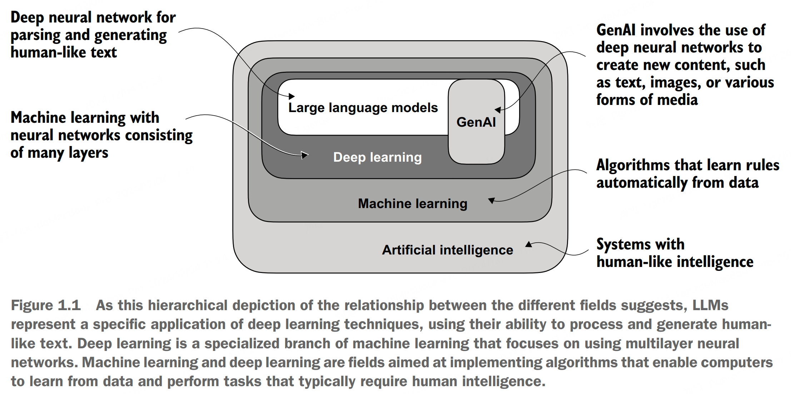
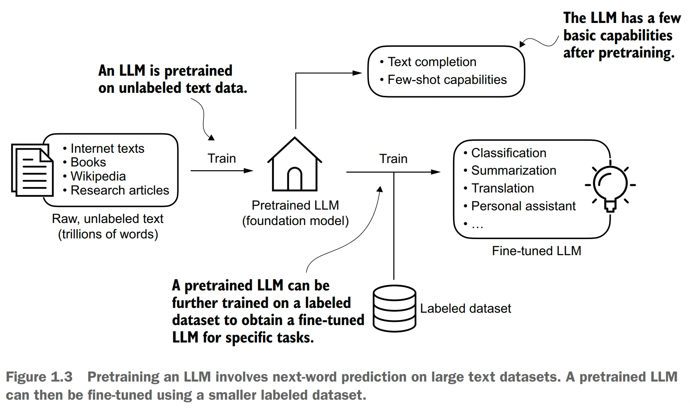
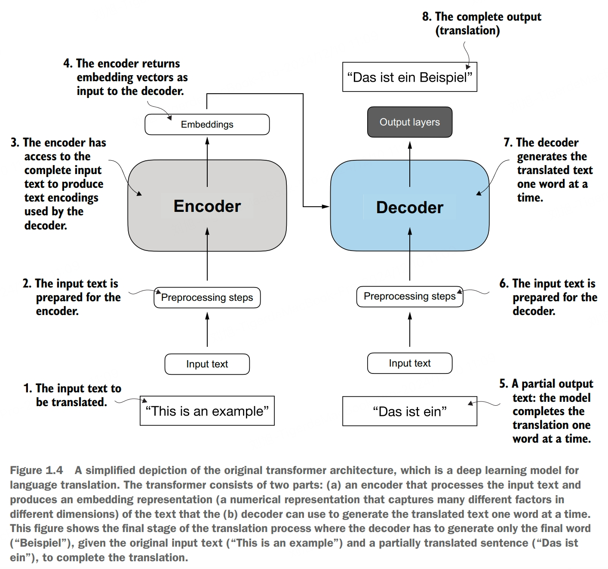
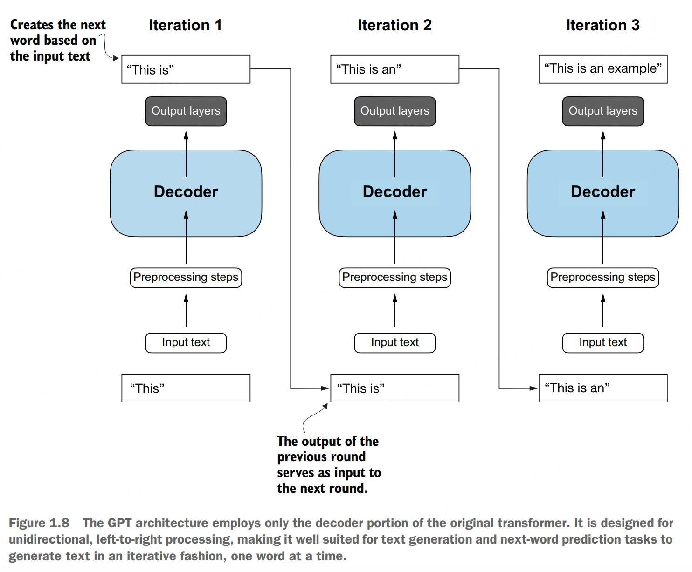

# What is an LLM?
An LLM is a neural network designed to understand, generate, and respond to human-like text.

The "large" in LLM refers to both the model's size in terms of parameters and the immense dataset on which it's trained. Models like this often have tens or even thousands of billions of parameters, which are the adjustable weights in the network that are optimized during training to predict the next word in a sequence.

LLMs utilize an architecture called the *transformer*, which allows them to pay selective attention to different parts of the input when making predictions, making them especially adept at handling the nuances and complexities of human language.

The success behind LLMs can be attributed to the transformer architecture that underpins many LLMs and the vast amounts of data on which LLMs are trained, allowing them to capture a wide variety of lingustic nuances, and patterns that would be challenging to encode manually. This shift toward implementing models based on the transformer architecture and using large training datasets to train LLMs has fundamentally transformed NLP, providing more capable tools for understanding and interacting with human language.

LLMs have remarkable capabilities to understand, generate, and interpret human language. However, it's important to clarify that when we say language models "understand," we mean that they can process and generate text in ways that appear coherent and contextually relevant, not that they possess human-like consciousness or comprehension.

Enabled by advancements in deep learning, which is a subset of machine learning and AI focused on neural networks, LLMs are trained on vast quantities of text data. This large-scale training allows LLMs to capture deeper contextual information and subtleties of human language compared to previous approaches. As a result, LLMs have significantly improved performance in a wide range of NLP tasks, including text translation, sentiment analysis, question answering, and many more.

While the field of AI is now dominated by machine learning and deep learning, it also includes other approaches, for example, using rule-based systems, genetic algorithms, expert systems, fuzzy logic, or symbolic reasoning.

# Stages of Building LLMs
The general process of creating an LLM include pretraining and fine-tuning. The "pre" in "pretraining" refers to the initial phase where a model like an LLM is trained on a large, diverse dataset to develop a broad understanding of language. This pretrained model then serves as a foundational resource that can be further refined through fine-tuing, a process where the model is specifically trained on a narrower dataset that is more specific to particular tasks or domains.

Readers with a background in machine learning may note that labeling information is typically required for traditional machine learning models and deep neural networks trained via the conventional supervised learning paradigm. However, this is not the case for the pretraining stage of LLMs. In this phase, LLMs use self-supervised learning, where the model generates its own labels from the input data.

A pretrained LLM is often called a *base* or *foundation model*. A typical example of such a model is the GPT-3 model. This model is capable of text completion, that is, finishing a half-written sentence provided by a user. It also has limited few-shot capabilities, which means it can learn to perform new tasks based on only a few examples instead of needing extensive training data.

After obtaining a pretrained LLM from training on large text datasets, where the LLM is trained to predict the next word in the text, we can further train the LLM on labeled data, also known as *fine-tuning*. The two most popular categories of fine-tuning LLMs are *instruction fine-tuning* and *classification fine-tuning*.

# Transformer Architecture
The transformer architecture consists of two submodules: an encoder and a decoder. The encoder module processes the input text and encodes it into a series of numerical representations or vectors that capture the contextual information of the input. Then, the decoder module takes these encoded vectors and generates the output text. Both of the encoder and decoder consist of many layers connected by a so-called *self-attention machanism*.

A key component of transformers and LLMs is the self-attention mechanism, which allows the model to weigh the importance of different words or tokens in a sequence relative to each other. This mechanism enables the model to capture long-range dependencies and contextual relationships within the input data, enhancing its ability to generate coherent and contextually relevant output.

Later variants of the transformer architecture, such as BERT (bidirectional encoder representations from transformers) and the various GPT models (generative pretrained transformers), built on this concept adapt this architecture for different tasks. 

BERT, which is built upon the original transformer's encoder submodule, differs in its training approach from GPT. While GPT is designed for generative tasks, BERT and its variants specialize in masked word prediction, where the model predicts masked or hidden words in a given sentence.

GPT models, primarily designed and trained to perform text completion tasks, also show remarkable versatility in their capabilities. These models are adept at executing both zeor-shot and few-shot learning tasks. Zero-shot learning refers to the ability to generalize to completely unseen tasks without any prior specific examples. On the other hand, few-shot learning involves learning from a mimimal number of examples the user provides as input.

Note that not all transformers are LLMs since transformers can also be used for computer vision. Also, not all LLMs are transformers, as there are LLMs based on recurrent and convolutional architectures.

# Big Data
The large training datasets for popular GPT- and BERT-like models represent diverse and comprehensive text corpora encompassing billions of words, which include a vast array of topics and natural and computer languages. The pretrained nature of these models makes them incredibly versatile for further fine-tuning on downstream tasks, which is why they are also known as base or foundation models. 

Pretraining LLMs requires access to significant resources and is very expensive. The good news is that many pretained LLMs, available as open source models, can be used as general-purpose tools to write, extract, and edit texts that were not part of the training data. Also, LLMs can be fine-tuned on specifc tasks with relatively smaller datasets, reducing the computational resources needed and improving performance.

# GPT Architecture
Compared to the original transformer architecture, the general GPT architecture is relatively simple. Essentially, it's just the decoder part without the encoder. Since decoder-style models like GPT generate text by predicting text one word at a time, they are considered a type of *autogressive* model. Autogressive models incorporate their previous outputs as inputs for future predictions. Consequently, in GPT, each new word is chosen based on the sequence that precedes it, which improves the coherence of the resulting text.

GPT models are competent text completion models that can carry out other tasks such as spelling correction, classification, or language translation. This is actually very remarkable given that GPT models are pretrained on a relatively simple next-word prediction task.

In the next-word prediction pretraining task for GPT models, the system learns to predict the upcoming word in a sentence by looking at the words that have come before it. This approach helps the model understand how words and phrases typically fit together in language, forming a foundation that can be applied to various other tasks.

The next-word prediction task is a form of self-supervised learning, which is a form of self-labeling. This means that we don't need to collect labels for the training data explicitly but can use the structure of the data itself: we can use the next word in a sentence or document as the label that the model is supposed to predict. Since this next-word prediction task allows us to create labels "on the fly," it is possible to use massive unlabeled text datasets to train LLMs.

Although the original transformer model, consisting of encoder and decoder blocks, was explicitly designed for language translation, GPT models, despite their larger yet simpler decoder-only architecture aimed at next-word prediction, are also capable of performing translation tasks. This capability was initially unexpected to researchers, as it emerged from a model primarily trained on a next-word prediction task, which is a task that did not specifically target translation.

The ability to perform tasks that the model wasn't explicitly trained to perform is called an *emergent behavior*. This capability isn't explicitly taught during training but emerges as a natural consequence of the model's exposure to vast quantities of multilingual data in diverse contexts. The fact that GPT models can "learn" the translation patterns between languages and perform translation tasks even though they weren't specifically trained for it demonstrates the benefits and capabilities of these large-scale, generative language models.