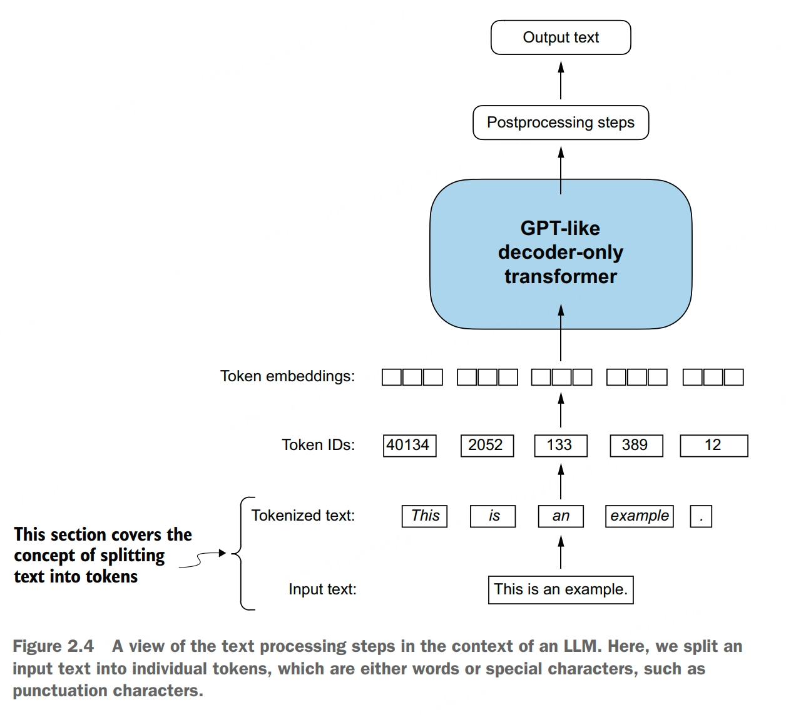
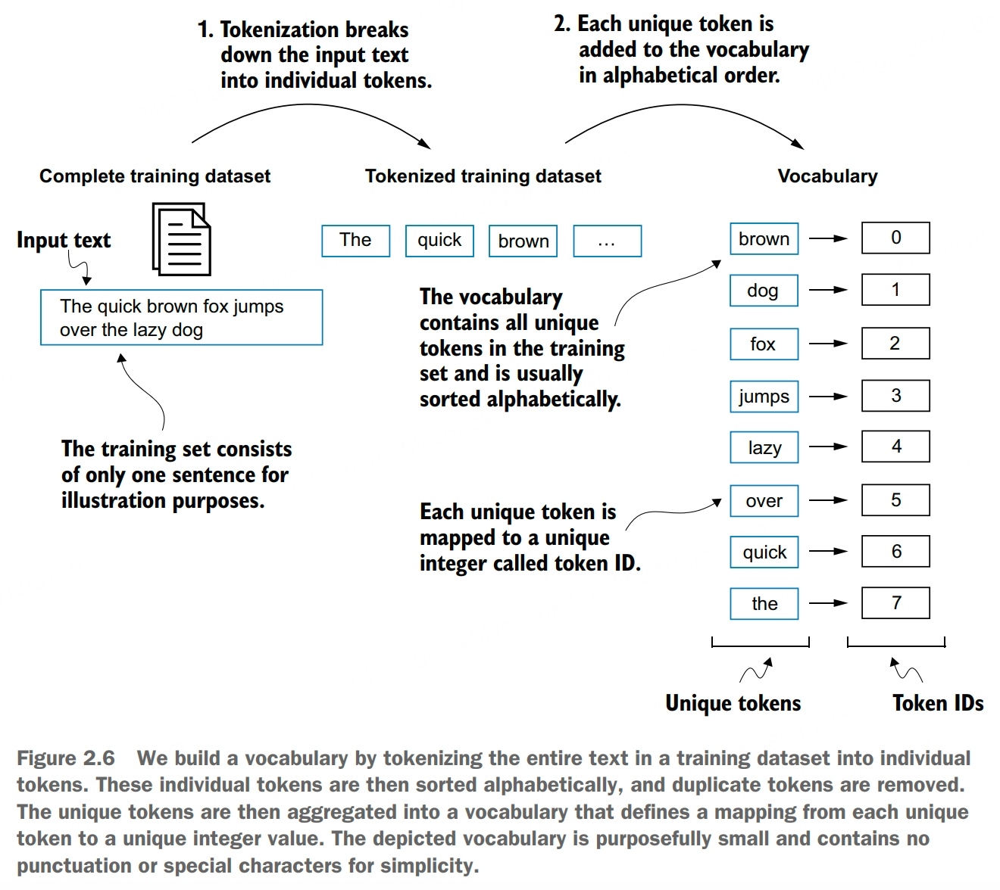
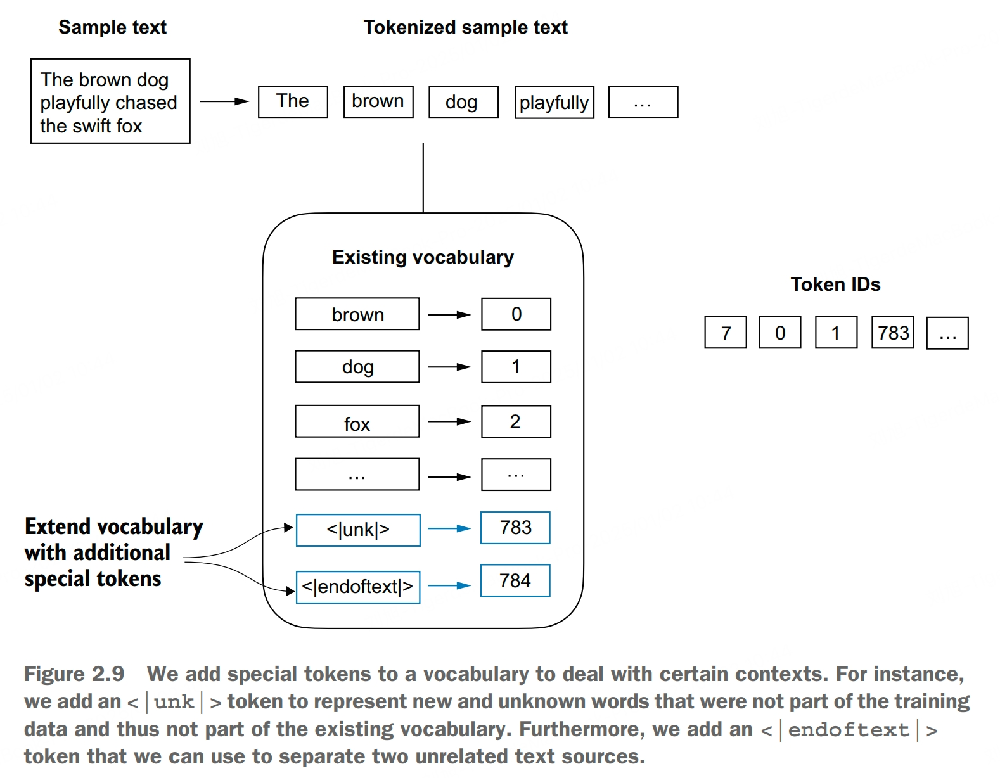
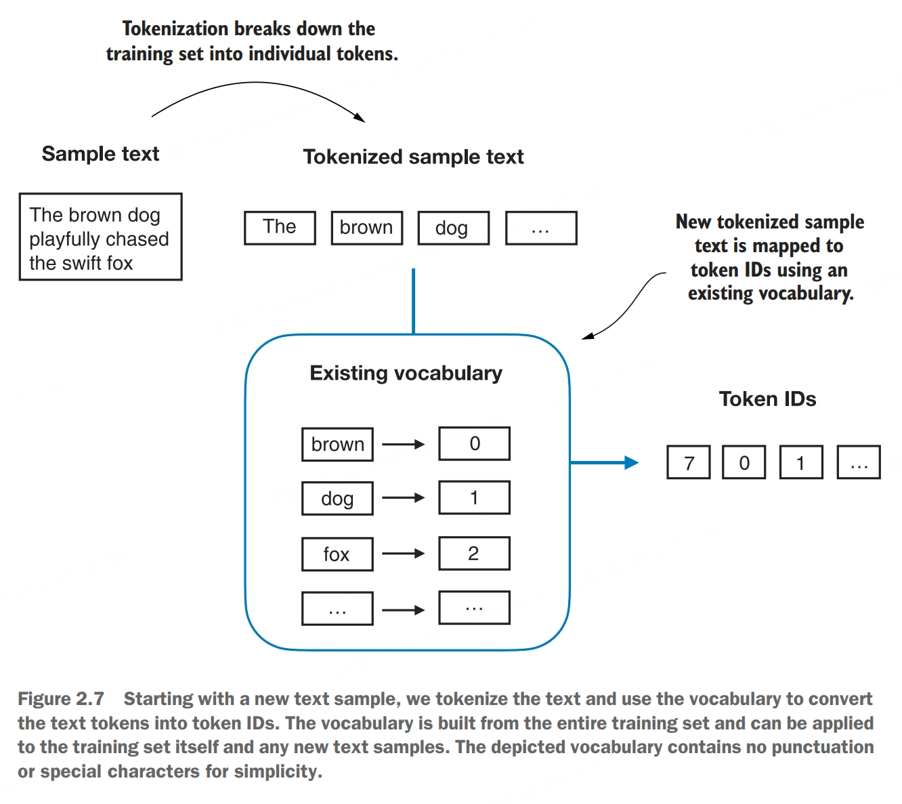

# Embeddings
Deep neural network models, including LLMs, cannot process raw text directly. We need a way to represent words as continuous-valued vectors. The concept of converting data into a vector format is often referred to as *embedding*.

Using a specific neural network layer or another pretrained neural network model, we can embed differnet data types, for example, video, audio, and text. It is important to note that different data formats require distinct embedding models. For example, an embedding model designed for text would not be suitable for embedding audio or video data.

At its core, an embedding is a mapping from discrete objects, such as words, images, or even entire documents, to points in a continuous vector space, the primary purpose of embeddings is to convert nonnumeric data into a format that neural networks can process.

While word embeddings are the most common form of text embedding, there are also embeddings for sentences, paragraphs, or whole documents. Sentence or paragraph embeddings are popular choice for *retrieval-augmented generation*.

Several algorithms and frameworks have been developed to generate word embeddings. One of the earlier and most popular examples is the *Word2Vec* approach. Word2Vec trained neural network architecture to generate word embeddings by predicting the context of a word given the target word or vice versa. The main idea behind Word2Vec is that words that appear in similar contexts tend to have similar meanings.

Word embeddings can have varying dimensions, from one to thousands. A higher dimensionality might capture more naunced relationships but at the cost of computational efficiency.

While we can use pretrained models such as Word2Vec to generate embeddings for machine learning models, LLMs commonly produce their own embeddings that are part of the input layer and are updated during training. The advantage of optimizing the embeddings as part of the LLM training instead of using Word2Vec is that the embeddings are optimized to the specific task and data at hand.

The required steps for preparing the embeddings used by an LLM include splitting text into words, converting words into tokens, and turning tokens into embedding vectors.

# Tokenization

